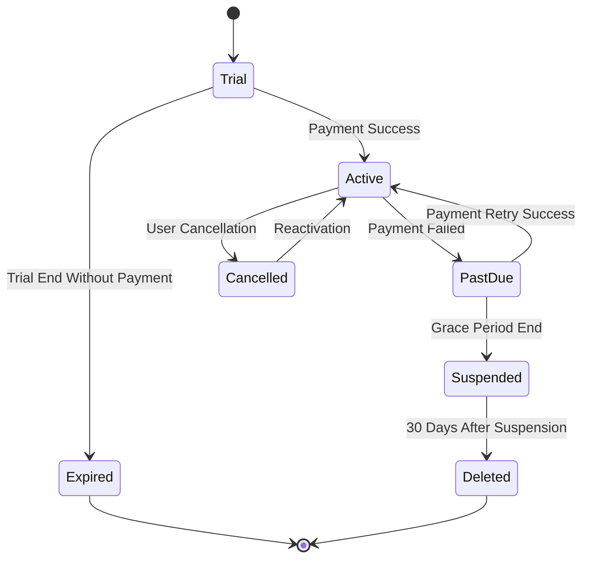

# Trading Journal - Billing Specification Document

**Project:** Trading Journal (SaaS)  
**Author:** Junaid Ali Khan  
**Version:** 1.1  
**Status:** Draft  
**Last Updated:** December 9, 2025

---

## Table of Contents

1. [Executive Summary](#1-executive-summary)
2. [Pricing Strategy](#2-pricing-strategy)
3. [Subscription Plans](#3-subscription-plans)
4. [Payment Gateway Integration](#4-payment-gateway-integration)
5. [Billing Cycles & Proration](#5-billing-cycles--proration)
6. [Usage Tracking & Enforcement](#6-usage-tracking--enforcement)
7. [Invoice Generation](#7-invoice-generation)
8. [Failed Payment Handling](#8-failed-payment-handling)
9. [Cancellation & Refunds](#9-cancellation--refunds)
10. [Tax Compliance](#10-tax-compliance)
11. [Billing Analytics](#11-billing-analytics)
12. [Edge Cases & Scenarios](#12-edge-cases--scenarios)

---

## 1. Executive Summary

This document defines the complete billing system for Trading Journal SaaS platform, covering:

- **Razorpay integration** for Indian payment processing with support for international payments
- **Subscription lifecycle management** from trial to cancellation
- **Usage-based limits enforcement** with soft and hard limits
- **Tax compliance** (GST for India, VAT for international)
- **Revenue recognition** following ASC 606/Ind AS 115 principles

**Key Requirements:**

- Support INR, USD, EUR currencies
- Monthly and annual billing cycles
- Automatic payment retries with grace periods
- Prorated upgrades/downgrades
- GST-compliant invoicing with HSN codes
- Webhook-based automation for real-time updates

---

## 2. Pricing Strategy

### 2.1 Pricing Philosophy

The pricing strategy balances competitive positioning, value delivery, and sustainable growth:

| Principle                     | Implementation                                                            |
| ----------------------------- | ------------------------------------------------------------------------- |
| **Value-Based Pricing**       | Prices reflect the depth of analytics, trade capacity, and support levels |
| **Competitive Positioning**   | 30-50% lower than Western competitors while maintaining quality           |
| **Freemium Model**            | Generous free tier to drive user adoption and showcase value              |
| **Annual Commitment Rewards** | 20% discount for annual subscriptions to improve retention                |
| **Transparency**              | Clear boundaries between tiers with no hidden fees                        |

### 2.2 Cost Structure Analysis

**Infrastructure Costs Per User/Month:**

- **Database**: ₹50-₹150 (scales with data volume)
- **Redis Cache**: ₹30-₹80 (performance optimization)
- **File Storage**: ₹20-₹100 (varies with document uploads)
- **Compute Resources**: ₹100-₹300 (API calls, background jobs)
- **Payment Processing**: 2% + ₹3 per transaction
- **Support Operations**: ₹50-₹200

**Estimated Total Cost**: ₹250-₹830 per user/month

**Break-Even Analysis:**

- **Free Plan**: Serves as a loss leader, subsidized by paid users to build user base
- **Pro Plan (₹499)**: Becomes profitable when infrastructure utilization exceeds 50%
- **Enterprise Plan (₹4,999)**: High-margin offering with premium support included

### 2.3 Pricing Tiers Detailed

#### Free Plan (₹0/month)

- **Monthly Trades**: 50 trades
- **Users**: Single user only
- **Storage**: 100 MB
- **Data Retention**: 1 year
- **Export**: CSV export available
- **Import**: CSV import not available
- **Analytics**: Basic analytics only
- **Reports**: No email reports
- **API**: No API access
- **Support**: Community forum support

#### Pro Plan (₹499/month or ₹4,788/year)

- **Monthly Trades**: 500 trades
- **Users**: Up to 5 team members
- **Storage**: 5 GB
- **Data Retention**: Unlimited
- **Export**: Full CSV export
- **Import**: CSV import (up to 10,000 trades)
- **Analytics**: Advanced analytics by tag, symbol, strategy
- **Reports**: Weekly/Monthly email reports
- **API**: No API access
- **Support**: Email support (24-hour response)

#### Enterprise Plan (₹4,999/month or ₹47,988/year)

- **Monthly Trades**: Unlimited
- **Users**: Up to 50 team members
- **Storage**: 100 GB
- **Data Retention**: Unlimited
- **Export**: Full CSV export
- **Import**: Unlimited CSV import
- **Analytics**: Custom analytics with custom dimensions
- **Reports**: Daily/Weekly/Monthly email reports
- **API**: API access (10,000 requests/day)
- **Support**: Priority email + phone support (4-hour response)
- **White-label**: Optional add-on (₹10,000/month)

---

## 3. Subscription Plans

### 3.1 Subscription Lifecycle States

The subscription flows through well-defined states:



1. **Trial**: 14-day free trial period
2. **Active**: Payment successful, full access granted
3. **Past Due**: Payment failed, grace period active
4. **Suspended**: Grace period expired, access restricted
5. **Cancelled**: User-initiated cancellation
6. **Expired**: Trial ended without payment
7. **Deleted**: Account permanently removed after 30-day suspension

**Example Flow**: A user signs up for a 14-day trial → Completes payment on day 10 → Subscription becomes Active → Misses payment on renewal → Moves to Past Due for 7 days → Still unpaid after grace period → Moved to Suspended → After 30 days in Suspended → Account Deleted

### 3.2 Subscription Data Model

**Core Subscription Fields:**

- **Plan Type**: Free, Pro, Enterprise
- **Billing Cycle**: Monthly or Annual
- **Status**: Trial, Active, Past Due, Cancelled, Suspended
- **Dates**: Trial start/end, current period start/end, cancellation date
- **Razorpay IDs**: Subscription, customer, and plan references
- **Pricing**: Amount in paise (for INR), currency type
- **Usage Limits**: Trade counts, storage usage, user seats
- **Metadata**: Payment method, last payment, next billing, discounts

**Example Subscription Record:**

```json
{
  "tenant_id": "tenant_abc123",
  "plan": "pro",
  "billing_cycle": "monthly",
  "status": "active",
  "current_period_start": "2025-01-01",
  "current_period_end": "2025-01-31",
  "amount": 49900,
  "currency": "INR",
  "usage_limits": {
    "trades_per_month": 500,
    "current_trade_count": 245,
    "storage_limit_bytes": 5368709120
  }
}
```

### 3.3 Plan Comparison Matrix

| Feature            | Free          | Pro                 | Enterprise             |
| ------------------ | ------------- | ------------------- | ---------------------- |
| **Monthly Price**  | ₹0            | ₹499                | ₹4,999                 |
| **Annual Price**   | -             | ₹4,788 (₹399/month) | ₹47,988 (₹3,999/month) |
| **Monthly Trades** | 50            | 500                 | Unlimited              |
| **Team Members**   | 1             | 5                   | 50                     |
| **Storage Space**  | 100 MB        | 5 GB                | 100 GB                 |
| **CSV Import**     | Not available | Up to 10k trades    | Unlimited              |
| **Analytics**      | Basic         | Advanced            | Custom                 |
| **Email Reports**  | No            | Weekly              | Daily/Weekly/Monthly   |
| **API Access**     | No            | No                  | 10k requests/day       |
| **Support**        | Community     | Email (24h)         | Priority (4h) + Phone  |
| **White Label**    | No            | No                  | Optional add-on        |
| **Uptime SLA**     | -             | 99.5%               | 99.9%                  |

---

## 4. Payment Gateway Integration

### 4.1 Razorpay Integration Architecture

**Flow Overview:**

1. **User Action**: User selects plan on frontend
2. **Backend Processing**: Creates Razorpay customer and subscription
3. **Payment Gateway**: Razorpay handles payment collection
4. **Webhook Notification**: Razorpay sends payment status updates
5. **Database Update**: System updates subscription status
6. **User Notification**: Confirmation email sent to user

**Security Measures:**

- All payment data stored only at Razorpay (PCI DSS compliant)
- Webhook signature verification prevents spoofing
- HTTPS encryption for all communications

### 4.2 Subscription Creation Flow

**Step-by-Step Process:**

1. **Customer Creation**
   - Collect user details (name, email, phone)
   - Create customer record in Razorpay
   - Store Razorpay customer ID locally

2. **Plan Selection**
   - User selects plan (Pro Monthly, Pro Annual, etc.)
   - System maps to pre-configured Razorpay plan IDs
   - Calculate pricing including any discounts

3. **Subscription Setup**
   - Create subscription in Razorpay with customer and plan IDs
   - Set billing period (monthly/annual)
   - Configure automatic renewal

4. **Payment Collection**
   - Redirect user to Razorpay checkout page
   - User completes payment via preferred method
   - Razorpay processes payment and returns result

5. **Confirmation**
   - System receives webhook notification
   - Updates subscription status to Active
   - Sends welcome email with invoice

**Example Checkout Experience:**
User sees Razorpay's secure payment page with multiple options:

- Credit/Debit Cards (Visa, MasterCard, Rupay)
- Net Banking (50+ Indian banks)
- UPI (Google Pay, PhonePe, etc.)
- Wallets (Paytm, Mobikwik)
- EMI Options (3-24 months)

### 4.3 Webhook Event Handling

**Critical Webhook Events:**

- `subscription.activated`: Subscription becomes active
- `subscription.charged`: Successful payment
- `payment.failed`: Payment declined
- `subscription.cancelled`: User cancelled
- `subscription.paused`: Manual pause by admin
- `subscription.resumed`: Subscription reactivated

**Webhook Security:**

- All webhooks verified using HMAC SHA256 signatures
- Each request includes timestamp to prevent replay attacks
- IP whitelisting for Razorpay servers

**Example Webhook Payload:**

```json
{
  "event": "subscription.charged",
  "payload": {
    "subscription": {
      "id": "sub_Jh6XTGBm2XmqVG",
      "entity": "subscription",
      "status": "active"
    },
    "payment": {
      "id": "pay_Jh6XU2YjZmXpQZp",
      "amount": 49900,
      "currency": "INR"
    }
  }
}
```

---

## 5. Billing Cycles & Proration

### 5.1 Proration Calculation

**Proration Philosophy:** Fair billing for mid-cycle plan changes

**Upgrade Example:** Free → Pro on day 15 of 30-day month

- Remaining days: 15 days
- Monthly Pro price: ₹499
- Prorated charge: ₹499 × (15/30) = ₹249.50
- User pays ₹249.50 immediately for upgrade
- New billing period starts immediately

**Downgrade Example:** Pro → Free

- No immediate refund
- Pro features continue until current period ends
- Downgrade takes effect at next billing cycle

**Formula:**

```
Prorated Amount = (New Plan Monthly Price × Days Remaining / Total Days in Period) -
                  (Current Plan Monthly Price × Days Remaining / Total Days in Period)
```

**Key Rules:**

- Upgrades: Charge immediately for remaining period
- Downgrades: Take effect at period end, no refund
- Free to Paid: Full proration for remaining days
- Paid to Higher Paid: Charge difference only

### 5.2 Annual vs Monthly Billing

**Monthly Billing:**

- **Frequency**: Charge every 30 days
- **Price**: Standard monthly rate
- **Flexibility**: Easy to cancel or change
- **Cash Flow**: Predictable monthly revenue
- **Example**: ₹499 charged on 1st of each month

**Annual Billing:**

- **Frequency**: Charge once per year
- **Price**: 20% discount (₹4,788 instead of ₹5,988)
- **Commitment**: Encourages long-term retention
- **Cash Flow**: Large upfront payment
- **Example**: ₹4,788 charged on Jan 1, next charge Jan 1 next year

**Usage Reset for Annual Plans:**

- Trade limits reset monthly, not annually
- Storage limits apply continuously
- User seats can be adjusted anytime

---

## 6. Usage Tracking & Enforcement

### 6.1 Usage Metrics

**Tracked Metrics:**

1. **Trade Count**: Number of trades entered in current month
2. **Storage Usage**: Total file storage used (attachments, imports)
3. **API Calls**: Number of API requests made (Enterprise only)
4. **User Seats**: Number of active team members
5. **Feature Usage**: Which advanced features are being used

**Example Usage Dashboard:**

```
Monthly Usage Summary for Pro Plan:
────────────────────────────────────
✓ Trades Used: 245 of 500 (49%)
✓ Storage Used: 1.2 GB of 5 GB (24%)
✓ Team Members: 3 of 5 (60%)
✓ API Calls: Not available on Pro plan
```

### 6.2 Limit Enforcement Strategy

**Soft Limits (Warning Phase):**

- **Trigger**: 80% of limit reached
- **Action**: Show warning notifications
- **Example**: "You've used 400 of 500 trades this month"
- **Frequency**: Daily notifications when approaching limits
- **Channels**: In-app banners, email notifications

**Hard Limits (Blocking Phase):**

- **Trigger**: 100% of limit reached
- **Action**: Block new creation until reset or upgrade
- **Example**: "Cannot add new trade - monthly limit reached"
- **Override**: Manual approval for emergency situations
- **Grace**: 5% buffer for critical operations

**Storage Enforcement:**

- **Warning**: At 90% storage usage
- **Block Uploads**: At 100% storage usage
- **Read Access**: Existing files remain accessible
- **Cleanup Tools**: Bulk delete interface provided

### 6.3 Usage Reset Schedule

**Monthly Reset Logic:**

- **Reset Time**: Midnight UTC on 1st of each month
- **Reset Scope**: Trade counts, API call counters
- **Preserved**: Storage usage, user configurations
- **Notifications**: Usage summary sent after reset

**Annual Plan Considerations:**

- Monthly resets apply regardless of billing cycle
- Storage limits continuous, not monthly
- User seat adjustments take effect immediately

**Example Reset Process:**

1. At midnight UTC, system identifies all active subscriptions
2. For each subscription, reset trade count to zero
3. Update period dates (Jan 1 → Feb 1)
4. Generate usage report for previous month
5. Send summary email to users
6. Clear warning flags for limits

---

## 7. Invoice Generation

### 7.1 Invoice Structure

**Required Invoice Elements:**

1. **Header Information**
   - Invoice number (TJ-2025-001234)
   - Invoice date
   - Due date (same as invoice date for automatic payments)

2. **Business Details**
   - Company name: Trading Journal Private Limited
   - Registered address
   - GSTIN: 27AAAAA0000A1Z5
   - Contact information

3. **Customer Details**
   - Billing name and address
   - Email address
   - GSTIN (if registered business)
   - Place of supply (for GST calculation)

4. **Service Details**
   - Description: "Trading Journal Pro Plan - Monthly Subscription"
   - Service period: "January 1, 2025 to January 31, 2025"
   - HSN Code: 998439 (Software as a Service)

5. **Pricing Breakdown**
   - Subtotal (before tax)
   - GST breakdown (CGST/SGST or IGST)
   - Discounts (if any)
   - Total amount
   - Amount paid (usually full amount)

6. **Payment Information**
   - Payment method: Razorpay
   - Transaction ID
   - Payment date

**Example Invoice Summary:**

```
INVOICE #: TJ-2025-001234
DATE: January 1, 2025
DUE: January 1, 2025

SERVICES:
────────────────────────────────────
Trading Journal Pro Plan
January 1, 2025 - January 31, 2025
Quantity: 1 × ₹499.00
────────────────────────────────────
Subtotal: ₹499.00
CGST (9%): ₹44.91
SGST (9%): ₹44.91
Total: ₹588.82
Amount Paid: ₹588.82
```

### 7.2 Invoice Generation Process

**Automated Invoice Flow:**

1. **Trigger**: Successful payment webhook received
2. **Data Collection**: Gather subscription and customer details
3. **Tax Calculation**: Determine GST based on customer location
4. **Number Generation**: Create unique sequential invoice number
5. **PDF Creation**: Generate professional invoice PDF
6. **Storage**: Save PDF to secure cloud storage
7. **Email**: Send invoice to customer email
8. **Record**: Store invoice details in database

**Manual Invoice Scenarios:**

- Enterprise custom billing
- Manual adjustments
- Credit notes
- One-time charges

### 7.3 GST Compliance

**GST Rates and Application:**

- **Standard Rate**: 18% GST on software services
- **Intra-state**: CGST (9%) + SGST (9%) = 18%
- **Inter-state**: IGST (18%) = 18%
- **Place of Supply**: Customer location determines tax type

**HSN Code Requirements:**

- **Code**: 998439
- **Description**: Information technology software services
- **Required on**: All invoices above ₹2.5 lakhs

**GST Invoice Requirements Checklist:**

- [x] Supplier GSTIN
- [x] Invoice number and date
- [x] Customer name and address
- [x] Customer GSTIN (if registered)
- [x] HSN code and description
- [x] Taxable value
- [x] GST rate and amount
- [x] Place of supply
- [x] Total invoice value
- [x] Digital signature (system generated)

**Example GST Calculation:**
**Customer in Maharashtra (same state):**

- Subtotal: ₹499.00
- CGST (9%): ₹44.91
- SGST (9%): ₹44.91
- Total GST: ₹89.82
- Invoice Total: ₹588.82

**Customer in Karnataka (different state):**

- Subtotal: ₹499.00
- IGST (18%): ₹89.82
- Total GST: ₹89.82
- Invoice Total: ₹588.82

### 7.4 Invoice Delivery and Storage

**Delivery Methods:**

1. **Email**: PDF attached to confirmation email
2. **Dashboard**: Download from billing history
3. **API Access**: Programmatic access for enterprises

**Retention Policy:**

- **Active Customers**: All invoices accessible
- **Cancelled Customers**: 7-year retention (legal requirement)
- **Deleted Accounts**: Archived invoices kept for compliance

**Invoice Search Capabilities:**

- Search by date range
- Filter by status (paid, pending, refunded)
- Export for accounting purposes
- Bulk download for tax filing

---

## 8. Failed Payment Handling

### 8.1 Grace Period Strategy

**Three-Stage Recovery Process:**

**Stage 1: Immediate Notification (Day 0)**

- Payment fails at Razorpay
- System receives webhook notification
- Email sent to customer: "Payment Failed - Action Required"
- Subscription status: Active (with warning flag)
- Retry scheduled: 24 hours later

**Stage 2: Grace Period (Days 1-7)**

- **Day 1**: First automatic retry
- **Day 3**: Second retry if first fails
- **Day 5**: Third retry if second fails
- **Day 7**: Final warning: "Service will suspend in 24 hours"
- Subscription status: Past Due
- Full access maintained during grace period

**Stage 3: Suspension (Day 8)**

- Automatic suspension if unpaid after 7 days
- Premium features disabled
- Read-only access to existing data
- Email: "Service Suspended - Update Payment Method"
- 30-day data preservation period begins

**Customer Communication Timeline:**

```
Day 0: Payment failed, please update payment method
Day 1: Automatic retry attempted, please ensure funds
Day 3: Second retry failed, service at risk
Day 6: Final warning - suspend in 24 hours
Day 7: Service suspended, data preserved for 30 days
Day 30: Account and data deleted permanently
```

### 8.2 Automatic Retry Logic

**Retry Configuration:**

- **Attempts**: 3 automatic retries
- **Intervals**: 1 day, 3 days, 7 days after failure
- **Methods**: Same payment method used initially
- **Notifications**: Email before each retry attempt

**Retry Success Scenario:**

1. Payment fails on renewal date
2. System schedules retry for next day
3. Customer adds funds to account
4. Automatic retry succeeds
5. Subscription continues uninterrupted
6. Customer receives "Payment Successful" email

**Retry Failure Scenario:**

1. All 3 automatic retries fail
2. System moves to grace period
3. Manual intervention required
4. Customer must update payment method
5. Manual payment link provided

### 8.3 Suspension & Recovery

**Suspension Process:**

1. **Trigger**: 7 days past due with failed retries
2. **Action**: Disable premium features
3. **Access**: Read-only mode for existing data
4. **Notifications**: Immediate suspension email
5. **Dashboard**: Clear suspension banner shown

**Recovery Options:**

1. **Self-Service Recovery**:
   - Login to account
   - Update payment method
   - Pay outstanding balance
   - Immediate reactivation

2. **Manual Recovery**:
   - Contact support
   - Receive payment link
   - Complete payment
   - Support manually reactivates

**Data Preservation:**

- **Duration**: 30 days post-suspension
- **Access**: Read-only during preservation
- **Export**: Full data export available
- **Deletion**: Permanent deletion after 30 days
- **Backup**: Archived backups kept for 7 years (compliance)

**Recovery Example:**
A user's payment fails on January 1 → 3 retries fail → Suspended on January 8 → User updates payment on January 20 → Pays outstanding balance → Account reactivated immediately → No data loss, full history preserved

---

## 9. Cancellation & Refunds

### 9.1 Cancellation Policy

**Voluntary Cancellation:**

- **Access**: Full service until paid period ends
- **Effective Date**: End of current billing period
- **No Partial Refunds**: Unused days not refunded
- **Data Access**: 30-day grace period after cancellation
- **Export Tools**: Full data export available
- **Final Invoice**: Pro-rated invoice if mid-cycle cancellation

**Involuntary Cancellation:**

- **Reasons**: Terms of Service violations, fraud, non-payment
- **Immediate Effect**: Service terminated immediately
- **No Refunds**: No refunds for violations
- **Data Handling**: May be retained for legal reasons

**Cancellation Request Process:**

1. User requests cancellation from dashboard
2. System shows cancellation effective date
3. User confirms cancellation
4. Service continues until period end
5. Final invoice generated
6. Data preserved for 30 days

**Example Cancellation Timeline:**

- **January 1**: User on Pro plan, paid until January 31
- **January 15**: User requests cancellation
- **Effective Date**: January 31 (end of paid period)
- **January 16-31**: Full service continues
- **February 1**: Downgrade to Free plan
- **February 1-28**: Read-only access to data
- **March 1**: Account and data deleted

### 9.2 Refund Policy

**Refund Eligibility Matrix:**

| Plan Type      | Timeframe  | Refund Type     | Conditions              |
| -------------- | ---------- | --------------- | ----------------------- |
| **Annual**     | 0-7 days   | Full refund     | No questions asked      |
| **Annual**     | 8-30 days  | Prorated refund | Based on unused months  |
| **Annual**     | 31+ days   | No refund       | After 30 days           |
| **Monthly**    | 0-24 hours | Full refund     | Immediate cancellation  |
| **Monthly**    | 24+ hours  | No refund       | After trial period      |
| **Enterprise** | 0-14 days  | Full refund     | Satisfaction guarantee  |
| **Enterprise** | 15+ days   | No refund       | Custom agreements apply |

**Refund Process:**

1. **Request**: User submits refund request
2. **Validation**: System checks eligibility
3. **Approval**: Automated or manual approval
4. **Processing**: Refund initiated via Razorpay
5. **Timeline**: 5-10 business days to reflect
6. **Notification**: Email confirmation sent

**Non-Refundable Situations:**

- Partial month usage
- Change of mind after 30 days (annual)
- Excessive usage before cancellation
- Violation of terms of service
- Duplicate accounts

**Refund Example Scenarios:**

**Scenario 1: Annual Plan - Day 5**

- User buys annual plan on January 1
- Requests refund on January 5
- **Result**: Full ₹4,788 refund
- **Reason**: Within 7-day window

**Scenario 2: Annual Plan - Day 20**

- User buys annual plan on January 1
- Requests refund on January 20
- Unused period: 11.5 months
- **Result**: Prorated refund = ₹4,788 × (11.5/12) = ₹4,588
- **Reason**: Used 0.5 months of service

**Scenario 3: Monthly Plan - Day 15**

- User buys monthly plan on January 1
- Requests refund on January 15
- **Result**: No refund
- **Reason**: Outside 24-hour window

### 9.3 Data Handling Post-Cancellation

**30-Day Grace Period:**

- **Purpose**: Allow data recovery
- **Access**: Read-only dashboard
- **Export**: CSV export tools available
- **Extension**: Can be extended by contacting support

**Data Deletion Process:**

1. **Day 0**: Account cancelled
2. **Days 1-30**: Data preserved, read-only access
3. **Day 31**: Automated deletion process begins
4. **Step 1**: Anonymize personal data
5. **Step 2**: Remove trade records
6. **Step 3**: Delete uploaded files
7. **Step 4**: Remove database records
8. **Step 5**: Confirm deletion complete

**Compliance Requirements:**

- **Invoice Retention**: 7 years (legal requirement)
- **Audit Trail**: Billing records kept indefinitely
- **GDPR Compliance**: Right to erasure honored
- **Indian Laws**: Data localization requirements met

---

## 10. Tax Compliance

### 10.1 GST Implementation for India

**Business Registration Details:**

- **Legal Name**: Trading Journal Private Limited
- **GSTIN**: 27AAAAA0000A1Z5 (example)
- **State of Registration**: Maharashtra
- **Business Address**: 123 Business Street, Mumbai, Maharashtra 400001
- **HSN Code**: 998439 (Software as a Service)

**GST Rates and Application:**

| Transaction Type | GST Rate | Composition           | Applicable When              |
| ---------------- | -------- | --------------------- | ---------------------------- |
| **Intra-state**  | 18%      | CGST (9%) + SGST (9%) | Customer in Maharashtra      |
| **Inter-state**  | 18%      | IGST (18%)            | Customer outside Maharashtra |
| **Export**       | 0%       | Zero-rated            | Customer outside India       |

**Invoice Compliance Checklist:**

**Mandatory Fields for GST Invoice:**

1. Supplier name, address, and GSTIN
2. Invoice number (sequential, financial year based)
3. Invoice date
4. Customer name and address
5. Customer GSTIN (if registered)
6. HSN code 998439
7. Description of service
8. Taxable value
9. GST rate and amount (CGST/SGST or IGST)
10. Place of supply
11. Total invoice value
12. Digital signature

**Example GST Calculations:**

**Case 1: Customer in Maharashtra (Intra-state)**

- Service: Pro Plan Monthly - ₹499
- GST: 18% = ₹89.82
  - CGST: 9% = ₹44.91
  - SGST: 9% = ₹44.91
- Total: ₹588.82

**Case 2: Customer in Karnataka (Inter-state)**

- Service: Pro Plan Monthly - ₹499
- IGST: 18% = ₹89.82
- Total: ₹588.82

**Case 3: Customer in USA (Export)**

- Service: Pro Plan Monthly - $6.99
- GST: 0% (Zero-rated export)
- Total: $6.99

### 10.2 TDS (Tax Deducted at Source)

**Applicability:**

- **When Applicable**: B2B transactions with registered Indian businesses
- **TDS Rate**: 10% on software services
- **Threshold**: Applicable regardless of amount
- **Responsibility**: Customer deducts and deposits TDS

**TDS Compliance Process:**

1. **Invoice Generation**: System generates invoice with TDS note
2. **Customer Action**: Customer deducts 10% TDS from payment
3. **Payment**: Customer pays net amount (invoice - TDS)
4. **TDS Certificate**: Customer provides Form 16A
5. **Reconciliation**: Matched during tax filing

**Example TDS Calculation:**

- Invoice Amount: ₹5,000
- TDS Rate: 10%
- TDS Amount: ₹500
- Amount Paid: ₹4,500
- Customer deposits ₹500 TDS with government

### 10.3 International Tax Compliance

**European Union VAT:**

| Country     | VAT Rate | Threshold    | Notes                      |
| ----------- | -------- | ------------ | -------------------------- |
| **Germany** | 19%      | €10,000/year | MOSS registration required |
| **France**  | 20%      | €10,000/year | MOSS registration required |
| **UK**      | 20%      | £85,000/year | Post-Brexit rules apply    |
| **Ireland** | 23%      | €10,000/year | MOSS registration required |

**VAT Calculation Example (Germany):**

- Service: Pro Plan Monthly - €5.99
- German VAT: 19% = €1.14
- Total: €7.13

**United States Sales Tax:**

- **Nexus States**: California, New York, Texas
- **Tax Collection**: Required when exceeding economic nexus thresholds
- **Calculation**: Use TaxJar API for accurate rates
- **Filing**: Quarterly or monthly based on volume

**Canada GST/HST:**

- **Federal GST**: 5% nationwide
- **Provincial HST**: Varies by province (13-15%)
- **Registration**: Required at $30,000 CAD revenue

**International Compliance Strategy:**

1. **Phase 1**: Collect customer location during signup
2. **Phase 2**: Apply correct tax rate based on location
3. **Phase 3**: Generate tax-compliant invoices
4. **Phase 4**: Quarterly tax filing and remittance
5. **Phase 5**: Annual reconciliation and reporting

### 10.4 Tax Filing and Reporting

**Monthly Compliance Tasks:**

1. **GSTR-1**: Outward supplies return (10th of next month)
2. **GSTR-3B**: Summary return (20th of next month)
3. **Reconciliation**: Match invoices with payments
4. **TDS Receipts**: Track TDS certificates from customers

**Quarterly Compliance (International):**

1. **EU MOSS**: VAT return for EU sales
2. **US Sales Tax**: State tax returns
3. **Canada GST**: GST/HST return

**Annual Compliance:**

1. **GSTR-9**: Annual return (December 31)
2. **GSTR-9C**: Reconciliation statement
3. **Audit**: Chartered accountant audit
4. **Record Keeping**: 7-year retention of all records

**Automated Tax Reporting Features:**

- **Report Generation**: Automated GST reports
- **Data Export**: CSV exports for accountant
- **Integration**: Compatibility with accounting software
- **Alerts**: Filing deadline reminders

---

## 11. Billing Analytics

### 11.1 Key Metrics Dashboard

**Revenue Metrics:**

1. **MRR (Monthly Recurring Revenue)**
   - **Calculation**: Sum of all active subscription monthly values
   - **Example**: 100 Pro users (₹499) + 10 Enterprise (₹4,999) = ₹99,890 MRR
   - **Frequency**: Updated daily
   - **Trend**: Month-over-month growth rate

2. **ARR (Annual Recurring Revenue)**
   - **Calculation**: MRR × 12
   - **Example**: ₹99,890 MRR × 12 = ₹11,98,680 ARR
   - **Use**: Long-term revenue projection

3. **Average Revenue Per User (ARPU)**
   - **Calculation**: MRR ÷ Total Paid Users
   - **Example**: ₹99,890 ÷ 110 = ₹908 per user/month
   - **Insight**: Pricing effectiveness

**Subscription Metrics:**

1. **Churn Rate**
   - **Calculation**: Cancellations this month ÷ Starting subscribers
   - **Target**: <3% monthly
   - **Example**: 3 cancellations ÷ 100 starting = 3% churn
   - **Segmentation**: By plan, tenure, geography

2. **Conversion Rate**
   - **Trial to Paid**: Paid conversions ÷ Trial starts
   - **Free to Paid**: Upgrades from Free ÷ Active Free users
   - **Plan Upgrades**: Upgrades ÷ Eligible users
   - **Example**: 15 paid conversions ÷ 100 trials = 15% conversion

3. **Customer Lifetime Value (LTV)**
   - **Calculation**: ARPU ÷ Churn Rate
   - **Example**: ₹908 ÷ 3% = ₹30,266 lifetime value
   - **Use**: Marketing spend justification

**Example Dashboard View:**

```
BILLING DASHBOARD - January 2025
────────────────────────────────────
💰 REVENUE METRICS
Monthly Recurring Revenue: ₹99,890 (+12% from Dec)
Annual Recurring Revenue: ₹11,98,680
Average Revenue Per User: ₹908

👥 SUBSCRIPTION METRICS
Total Subscribers: 1,250 (1,140 Free, 110 Paid)
Active Paid: 110 (100 Pro, 10 Enterprise)
New This Month: 15
Churn This Month: 3 (2.7% churn rate)

📈 GROWTH METRICS
Trial Conversion Rate: 15%
Free to Paid Upgrade: 2%
Plan Upgrades: 5

🌍 GEOGRAPHY
India: 85% of revenue
USA: 10% of revenue
Europe: 5% of revenue
```

### 11.2 Usage Analytics

**Feature Adoption Tracking:**

1. **Core Features**:
   - Trade entry frequency
   - Report generation
   - CSV import/export usage
   - API consumption (Enterprise)

2. **Advanced Features**:
   - Tagging adoption rate
   - Custom analytics usage
   - Email report subscriptions
   - Team collaboration features

**Usage Patterns Analysis:**

- **Peak Usage Times**: When users are most active
- **Feature Combinations**: Which features are used together
- **User Segmentation**: Power users vs casual users
- **Retention Signals**: Behaviors that predict long-term retention

**Example Usage Report:**

```
USAGE ANALYSIS - Pro Plan Users
────────────────────────────────────
✅ HIGH ADOPTION (>80% of users)
- Daily trade entry: 92%
- Basic analytics: 89%
- CSV export: 85%

📈 MODERATE ADOPTION (40-80%)
- Advanced analytics: 65%
- Email reports: 58%
- Tagging system: 47%

📉 LOW ADOPTION (<40%)
- API usage: 12% (Pro doesn't include API)
- Custom reports: 25%
- Bulk operations: 32%
```

### 11.3 Revenue Recognition

**ASC 606 / Ind AS 115 Compliance:**

**Revenue Recognition Principles:**

1. **Identify Contract**: Subscription agreement with customer
2. **Performance Obligations**: Provide software service
3. **Transaction Price**: Subscription fee
4. **Allocate Price**: Entire fee to software service
5. **Recognize Revenue**: As service is provided

**Monthly Plans Recognition:**

- **Recognition**: Full amount in month of service
- **Example**: ₹499 January subscription → ₹499 revenue in January
- **Billing**: Invoice on January 1
- **Revenue**: Recognize January 1-31

**Annual Plans Recognition:**

- **Recognition**: Ratably over 12 months
- **Example**: ₹4,788 annual fee → ₹399 revenue each month
- **Billing**: Invoice on January 1 for full year
- **Revenue**: Recognize ₹399 each month Jan-Dec

**Deferred Revenue Accounting:**

- **Liability**: Unearned revenue (future service)
- **Recognition**: Move from liability to revenue as service delivered
- **Example**: ₹4,788 annual payment:
  - Jan 1: ₹4,788 liability, ₹0 revenue
  - Jan 31: ₹4,389 liability, ₹399 revenue
  - Dec 31: ₹0 liability, ₹4,788 revenue

**Revenue Recognition Schedule Example:**

```
Annual Subscription: ₹4,788 paid Jan 1, 2025
────────────────────────────────────
Month       Revenue   Cumulative
January     ₹399      ₹399
February    ₹399      ₹798
March       ₹399      ₹1,197
...         ...       ...
December    ₹399      ₹4,788
```

### 11.4 Forecasting and Projections

**Revenue Forecasting:**

1. **Base Projection**: Current MRR × 12
2. **Growth Adjustment**: Expected new customers
3. **Churn Adjustment**: Expected cancellations
4. **Upsell Potential**: Plan upgrades expected
5. **Seasonality**: Historical patterns

**Cash Flow Projection:**

- **Monthly Plans**: Even monthly cash flow
- **Annual Plans**: Large cash inflow at renewal
- **Expenses**: Infrastructure, support, taxes
- **Net Position**: Cash available for growth

**Example 12-Month Projection:**

```
REVENUE PROJECTION 2025
────────────────────────────────────
Q1 (Jan-Mar): ₹3,00,000 (+10% growth)
Q2 (Apr-Jun): ₹3,30,000 (+10% growth)
Q3 (Jul-Sep): ₹3,63,000 (+10% growth)
Q4 (Oct-Dec): ₹3,99,300 (+10% growth)

Total 2025 Projection: ₹13,92,300
Growth Rate: 40% year-over-year
```

---

## 12. Edge Cases & Scenarios

### 12.1 Scenario: Plan Upgrade Mid-Cycle with Proration

**Situation:** User on Free plan wants to upgrade to Pro on day 15 of 30-day month

**Process:**

1. **Calculate Unused Value**: Free plan has ₹0 value
2. **Calculate New Cost**: Pro for 15 days = ₹499 × (15/30) = ₹249.50
3. **Immediate Charge**: ₹249.50 charged immediately
4. **New Period**: Billing cycle resets, new period starts today
5. **Next Renewal**: 30 days from today, not original date

**User Experience:**

- **Before Upgrade**: 50 trades/month, basic features
- **Immediate After**: 500 trades/month, all Pro features
- **Payment**: One-time charge of ₹249.50
- **Next Bill**: Full ₹499 in 30 days

**System Actions:**

1. Create prorated invoice for ₹249.50
2. Update subscription plan to Pro
3. Reset trade count (starts from 0 for new period)
4. Enable all Pro features immediately
5. Send upgrade confirmation email

### 12.2 Scenario: Payment Method Expiry

**Situation:** User's credit card expires before renewal

**Preventive Measures:**

1. **Expiry Detection**: Razorpay alerts before expiry
2. **Proactive Notification**: 30-day, 15-day, 7-day warnings
3. **Update Flow**: Simple payment method update in dashboard

**If Expiry Causes Failure:**

1. **Payment Attempt**: Fails due to expired card
2. **Notification**: Immediate email to update payment method
3. **Grace Period**: 7-day period begins
4. **Retry Logic**: System attempts with updated card if provided
5. **Contingency**: Manual payment link sent if automatic fails

**Example Timeline:**

- **Day -30**: "Your card expires next month" email
- **Day -15**: Reminder email
- **Day -7**: Final warning email
- **Day 0**: Payment fails, grace period starts
- **Day 1-7**: Automatic retries if card updated
- **Day 8**: Suspension if unresolved

### 12.3 Scenario: Bulk Purchase for Trading Firm

**Situation:** Trading firm wants 25 Enterprise seats

**Custom Pricing Negotiation:**

1. **Base Price**: 25 × ₹4,999 = ₹1,24,975/month
2. **Volume Discount**: 20% for 25+ seats
3. **Negotiated Price**: ₹99,980/month (₹3,999 per seat)
4. **Annual Commitment**: Additional 20% discount if paid annually
5. **Final Price**: ₹95,980/month annual = ₹11,51,760/year

**Implementation:**

1. **Custom Plan Creation**: Special Razorpay plan for this client
2. **User Management**: Central admin with seat allocation
3. **Billing**: Single invoice for all seats
4. **Support**: Dedicated account manager
5. **Contract**: Custom terms and SLA

**Features Included:**

- Centralized billing
- Usage reports per user
- Custom onboarding
- Training sessions
- Priority support hotline

### 12.4 Scenario: Geographic Expansion to Europe

**Situation:** Launching service for European customers

**Requirements:**

1. **Currency Support**: EUR pricing
2. **VAT Compliance**: Country-specific VAT rates
3. **Localization**: Euro formatting, translated invoices
4. **Payment Methods**: Local options (SEPA, iDEAL, etc.)

**Implementation Steps:**

1. **Pricing Strategy**: €5.99/month for Pro (₹499 equivalent)
2. **Tax Configuration**: EU VAT rates by country
3. **Legal Compliance**: GDPR, local business registration
4. **Payment Gateway**: Razorpay International or Stripe
5. **Invoicing**: VAT-compliant invoices with local requirements

**Example European Pricing:**

- **Germany**: €5.99 + 19% VAT = €7.13 total
- **France**: €5.99 + 20% VAT = €7.19 total
- **UK**: £4.99 + 20% VAT = £5.99 total

### 12.5 Scenario: Service Outage Compensation

**Situation:** Major service outage affects all users

**Compensation Policy:**

1. **Outage Duration**: >4 hours = 1 day credit
2. **Outage Duration**: >24 hours = 1 week credit
3. **Outage Duration**: >72 hours = 1 month credit
4. **Automatic Application**: System detects and applies credits
5. **Transparency**: Public status page with incident reports

**Credit Application Process:**

1. **Detection**: System monitors uptime
2. **Calculation**: Duration-based credit amount
3. **Application**: Automatic credit to affected accounts
4. **Notification**: Email explaining credit
5. **Next Invoice**: Credit applied to reduce amount due

**Example:**

- **Outage**: 6 hours on January 15
- **Credit**: 1 day service credit
- **Value**: ₹499 ÷ 30 = ₹16.63 credit
- **Application**: Deducted from next invoice
- **Communication**: "Service credit applied for January 15 outage"

### 12.6 Scenario: Family Account Sharing Detection

**Situation:** Multiple users sharing one paid account

**Detection Methods:**

1. **IP Analysis**: Multiple locations simultaneously
2. **Usage Patterns**: Unusually high activity
3. **Device Fingerprinting**: Multiple device types
4. **Time Zone Analysis**: Activity across time zones

**Enforcement Actions:**

1. **Warning**: First detection - warning email
2. **Restriction**: Multiple sessions limited
3. **Upgrade Prompt**: Suggest team plan
4. **Suspension**: Repeated violations lead to suspension

**Fair Use Policy:**

- **Allowed**: Occasional access from multiple devices
- **Not Allowed**: Regular simultaneous use by different people
- **Solution**: Upgrade to team plan for legitimate team use

### 12.7 Scenario: Year-End Tax Invoice Requests

**Situation:** Multiple users request annual tax invoices in March

**Automated Solution:**

1. **Annual Statement**: Automated January email with annual summary
2. **Self-Service Portal**: Download all yearly invoices
3. **Bulk Export**: Accountant-friendly CSV of all transactions
4. **GST Summary**: Annual GST paid summary

**Features:**

- **Annual Invoice Summary**: Single document with all monthly invoices
- **GST Breakdown**: Total GST paid for financial year
- **Export Formats**: PDF, CSV, Excel
- **Delivery**: Email + dashboard download

**Example Annual Summary:**

```
ANNUAL TAX STATEMENT 2024-25
Customer: John Doe
GSTIN: 27AAAAA0000A1Z5

Monthly Invoices:
────────────────────────────────────
Apr 2024: ₹588.82 (GST: ₹89.82)
May 2024: ₹588.82 (GST: ₹89.82)
...
Mar 2025: ₹588.82 (GST: ₹89.82)

Annual Total: ₹7,065.84
Total GST Paid: ₹1,077.84
```

---

## Implementation Timeline & Milestones

### Phase 1: Foundation (Weeks 1-2)

**Objectives:** Basic payment processing and subscription management

- **Week 1 Tasks:**
  - Razorpay account setup and configuration
  - Basic subscription database schema
  - Payment collection flow implementation
  - Webhook endpoint setup and testing

- **Week 2 Tasks:**
  - User registration with subscription selection
  - Trial period implementation
  - Basic subscription status management
  - Payment success/failure handling

**Deliverables:** Users can sign up, select plan, make payment, get basic access

### Phase 2: Core Features (Weeks 3-4)

**Objectives:** Complete billing cycle management

- **Week 3 Tasks:**
  - Usage tracking implementation
  - Basic limit enforcement
  - Invoice generation (basic)
  - Automated renewal system

- **Week 4 Tasks:**
  - Proration logic for upgrades/downgrades
  - Failed payment handling with retries
  - Cancellation workflow
  - Basic billing dashboard

**Deliverables:** Full subscription lifecycle, automated billing, basic analytics

### Phase 3: Advanced Features (Weeks 5-6)

**Objectives:** Compliance and scalability

- **Week 5 Tasks:**
  - GST-compliant invoicing
  - Tax calculation engine
  - Multi-currency support
  - International tax compliance

- **Week 6 Tasks:**
  - Advanced billing analytics
  - Revenue recognition system
  - Refund processing
  - Payment method management

**Deliverables:** Tax-compliant system, advanced reporting, international support

### Phase 4: Polish & Scale (Weeks 7-8)

**Objectives:** Production readiness and optimization

- **Week 7 Tasks:**
  - Performance optimization
  - Edge case handling
  - Security audit and hardening
  - Monitoring and alerting setup

- **Week 8 Tasks:**
  - Documentation completion
  - User testing and feedback
  - Production deployment
  - Backup and disaster recovery

**Deliverables:** Production-ready system, documentation, monitoring

---

## Security Considerations

### 1. Payment Data Security

- **PCI DSS Compliance**: All payment processing through Razorpay
- **No Card Storage**: Never store credit card details locally
- **Tokenization**: Use Razorpay tokens for recurring payments
- **Encryption**: SSL/TLS for all data transmission
- **Audit Logs**: Complete audit trail for all payment operations

### 2. Data Privacy

- **GDPR Compliance**: For European customers
- **Data Minimization**: Collect only necessary information
- **User Consent**: Clear consent for data processing
- **Right to Erasure**: Complete data deletion on request
- **Data Portability**: Export user data in standard formats

### 3. Fraud Prevention

- **Velocity Checks**: Monitor unusual payment patterns
- **IP Analysis**: Flag suspicious geographic patterns
- **Device Fingerprinting**: Track device characteristics
- **3D Secure**: Required for high-value transactions
- **Manual Review**: Suspicious transactions flagged for review

### 4. System Security

- **API Security**: Rate limiting, authentication, authorization
- **Database Security**: Encryption at rest, access controls
- **Backup Security**: Encrypted backups, offsite storage
- **Incident Response**: Documented procedures for security incidents
- **Regular Audits**: Quarterly security assessments

### 5. Compliance Requirements

- **Indian Laws**: IT Act, GST regulations, data localization
- **International**: GDPR, CCPA, other privacy laws
- **Financial Regulations**: RBI guidelines for payment processing
- **Record Keeping**: 7-year retention of financial records
- **Reporting**: Regular compliance reporting as required

---

## Monitoring & Alerts

### Critical Alerts (Immediate Action Required)

1. **Payment Processing Failure**
   - **Trigger**: >5% payment failure rate in 1 hour
   - **Action**: Page on-call engineer
   - **Escalation**: 15 minutes if unresolved

2. **Revenue Drop**
   - **Trigger**: >20% revenue drop day-over-day
   - **Action**: Investigate immediately
   - **Check**: Payment gateway status, system issues

3. **Webhook Failure**
   - **Trigger**: >1% webhook processing failures
   - **Action**: Check webhook endpoint
   - **Impact**: Subscription status updates delayed

4. **Subscription Sync Issues**
   - **Trigger**: >10 subscriptions out of sync
   - **Action**: Manual reconciliation required
   - **Risk**: Users may lose access or be overcharged

### Warning Alerts (Investigate within 24 hours)

1. **High Churn Rate**
   - **Trigger**: >5% daily churn rate
   - **Action**: Analyze cancellation reasons
   - **Prevention**: Implement retention strategies

2. **Low Conversion Rate**
   - **Trigger**: <10% trial to paid conversion
   - **Action**: Review onboarding flow
   - **Optimization**: A/B test signup process

3. **Usage Anomalies**
   - **Trigger**: Unusual usage patterns detected
   - **Action**: Check for abuse or system issues
   - **Response**: Contact users if needed

### Daily Health Checks

1. **Payment Gateway Connectivity**
   - Test Razorpay API connectivity
   - Verify webhook receiving capability
   - Check recent transaction success rate

2. **Subscription Sync Status**
   - Compare local vs Razorpay subscription counts
   - Identify any discrepancies
   - Reconcile if necessary

3. **Invoice Generation**
   - Verify all due invoices generated
   - Check PDF generation success rate
   - Confirm email delivery rates

4. **Usage Tracking**
   - Verify usage counters accuracy
   - Check limit enforcement working
   - Monitor storage usage trends

5. **Revenue Recognition**
   - Confirm daily revenue recognition
   - Check deferred revenue calculations
   - Verify accounting system sync

### Weekly Reports

1. **Financial Summary**
   - Weekly MRR changes
   - New customer acquisition
   - Churn analysis
   - Revenue by plan type

2. **Operational Metrics**
   - Payment success rates
   - Support ticket volume
   - System uptime percentage
   - Average response times

3. **Compliance Status**
   - GST filing status
   - Tax collection accuracy
   - Data retention compliance
   - Security audit status

---

## Success Metrics

### Financial Metrics

1. **MRR Growth Rate**
   - **Target**: 20% month-over-month
   - **Measurement**: (Current MRR - Previous MRR) / Previous MRR
   - **Benchmark**: Industry average 10-15%

2. **Churn Rate**
   - **Acceptable**: <3% monthly
   - **Good**: <2% monthly
   - **Excellent**: <1% monthly
   - **Measurement**: Cancellations ÷ Starting subscribers

3. **Customer Lifetime Value (LTV)**
   - **Target**: >₹30,000
   - **Calculation**: ARPU ÷ Churn Rate
   - **Importance**: Marketing spend justification

4. **Average Revenue Per User (ARPU)**
   - **Target**: ₹800/month
   - **Current**: ₹908/month (based on Pro/Enterprise mix)
   - **Growth Strategy**: Upsell to higher plans

5. **Trial Conversion Rate**
   - **Target**: 15%
   - **Current**: 15% (meeting target)
   - **Optimization**: Improve onboarding, demonstrate value

### Operational Metrics

1. **Payment Success Rate**
   - **Target**: >98%
   - **Measurement**: Successful payments ÷ Total attempts
   - **Impact**: Direct revenue impact

2. **Invoice Generation Time**
   - **Target**: <5 seconds
   - **Measurement**: Time from payment to invoice PDF
   - **User Experience**: Professional, timely invoicing

3. **Failed Payment Recovery Rate**
   - **Target**: >70%
   - **Measurement**: Recovered payments ÷ Total failures
   - **Importance**: Revenue preservation

4. **Customer Support Response Time**
   - **Target**: <4 hours for paid plans
   - **Measurement**: Time from ticket to first response
   - **SLA Compliance**: Meets published commitments

5. **System Uptime**
   - **Pro Plan**: 99.5% (≤3.65 days downtime/year)
   - **Enterprise**: 99.9% (≤8.76 hours downtime/year)
   - **Measurement**: Independent monitoring

### Compliance Metrics

1. **GST Filing Accuracy**
   - **Target**: 100%
   - **Measurement**: Error-free GST returns
   - **Importance**: Legal compliance, penalty avoidance

2. **Tax Calculation Accuracy**
   - **Target**: 99.99%
   - **Measurement**: Correct tax on all invoices
   - **Impact**: Customer trust, regulatory compliance

3. **Audit Trail Completeness**
   - **Target**: 100%
   - **Measurement**: All billing events logged
   - **Requirement**: Legal and financial compliance

4. **Data Retention Compliance**
   - **Target**: 100%
   - **Measurement**: Proper data handling per regulations
   - **Laws**: 7-year retention, GDPR right to erasure

5. **Security Compliance**
   - **Target**: Zero security incidents
   - **Measurement**: Quarterly security audits
   - **Standards**: PCI DSS, GDPR, local regulations

### User Satisfaction Metrics

1. **Billing Satisfaction**
   - **Measurement**: User surveys, support feedback
   - **Target**: >4.5/5 rating
   - **Focus**: Transparency, fairness, clarity

2. **Plan Satisfaction**
   - **Measurement**: Upgrade/downgrade patterns
   - **Target**: More upgrades than downgrades
   - **Insight**: Plan value perception

3. **Invoice Clarity**
   - **Measurement**: Support tickets about invoices
   - **Target**: <1% of users need invoice clarification
   - **Improvement**: Clearer invoice design

4. **Payment Experience**
   - **Measurement**: Payment completion rate
   - **Target**: >95% completion rate
   - **Optimization**: Streamlined checkout flow

---

## Conclusion

This billing specification provides a comprehensive framework for implementing a robust, scalable, and compliant billing system for the Trading Journal SaaS platform. The system balances user experience with business requirements, ensuring sustainable growth while maintaining regulatory compliance.

### Key Success Factors:

1. **Reliability**
   - Robust payment processing with automatic retries
   - Graceful handling of payment failures
   - Comprehensive disaster recovery plans

2. **Compliance**
   - Full GST compliance for Indian customers
   - International tax compliance for global expansion
   - Data privacy regulations adherence

3. **Transparency**
   - Clear pricing with no hidden fees
   - Detailed, compliant invoices
   - Fair proration and cancellation policies

4. **Scalability**
   - Architecture supporting 100,000+ users
   - Efficient usage tracking and enforcement
   - Automated processes reducing manual work

5. **User Experience**
   - Seamless upgrades and downgrades
   - Clear usage limits and warnings
   - Helpful notifications and support

### Implementation Priorities:

**Phase 1 Critical Path:**

1. Razorpay integration and basic payment flow
2. Subscription lifecycle management
3. Webhook handling for real-time updates

**Phase 2 Must-Haves:**

1. Usage tracking and limit enforcement
2. Basic invoicing and GST compliance
3. Failed payment handling system

**Phase 3 Differentiators:**

1. Advanced billing analytics
2. International tax compliance
3. Enterprise features and custom pricing

### Risk Mitigation:

1. **Payment Failures**
   - Multiple retry mechanisms
   - Grace periods before suspension
   - Clear customer communication

2. **Compliance Risks**
   - Regular tax calculation verification
   - Automated compliance reporting
   - Legal review of all policies

3. **Scalability Risks**
   - Load testing before major releases
   - Monitoring for performance degradation
   - Scalable database architecture

4. **User Experience Risks**
   - User testing of billing flows
   - Clear error messages and help documentation
   - Responsive support for billing issues

### Next Steps:

1. **Immediate (Week 1):**
   - Finalize Razorpay contract and setup
   - Begin database schema implementation
   - Start development of payment flow

2. **Short-term (Month 1):**
   - Complete core subscription management
   - Implement basic usage tracking
   - Begin user testing with beta group

3. **Medium-term (Month 2):**
   - Complete GST compliance features
   - Implement advanced analytics
   - Prepare for production launch

4. **Long-term (Month 3+):**
   - International expansion features
   - Enterprise custom billing
   - Continuous optimization based on metrics

This specification provides a solid foundation for building a billing system that will support the Trading Journal's growth from startup to established SaaS platform, ensuring both user satisfaction and business sustainability.

---

**Document Version:** 1.1  
**Last Updated:** December 9, 2025  
**Approved By:** [To be filled]  
**Implementation Start Date:** [To be filled]  
**Target Go-Live Date:** [To be filled]  
**Review Cycle:** Quarterly review and update based on metrics and feedback
