# Trading Journal SaaS - System Design Document

**Project:** Trading Journal SaaS  
**Version:** 3.0  
**Status:** Final  
**Last Updated:** December 10, 2025  
**Author:** Junaid Ali Khan  

## 1. System Architecture Overview

### 1.1 High-Level Architecture

```mermaid
graph TB
    %% USERS
    User[👤 User<br/>Traders & Teams] --> Client
    
    %% FRONTEND LAYER
    subgraph Frontend["📱 Frontend - Next.js"]
        Client[💻 Web App<br/>Dashboard & Forms]
    end
    
    %% API REQUESTS
    Client -->|HTTP Requests| API
    
    %% API LAYER WITH AUTH
    subgraph Backend["⚙️ Backend API - Express.js"]
        API[🌐 REST API<br/>Endpoints]
        API --> Auth[🔐 Authentication<br/>JWT + Google]
        API -->|After Auth| Services[🔧 Services<br/>Business Logic]
    end
    
    %% EXTERNAL SERVICES
    subgraph External["🌐 External Services"]
        Razorpay[💳 Razorpay<br/>Payments]
        Email[📧 Resend<br/>Email]
        OAuth[🔓 Google<br/>OAuth Login]
    end
    
    Auth -->|Login Flow| OAuth
    Services -->|Process Payment| Razorpay
    Services -->|Send Email| Email
    
    %% BACKGROUND WORKERS
    Workers[🔧 Background Workers<br/>BullMQ] -->|Process| DB
    Workers -->|Upload| Storage
    Workers -->|Send| Email
    
    Services -.->|Queue Jobs| Workers
    
    %% DATA LAYER
    subgraph DataLayer["🗄️ Data & Storage"]
        DB[(📊 PostgreSQL<br/>Trades & Users)]
        Redis[(⚡ Redis<br/>Cache & Queue)]
        Storage[☁️ S3 Storage<br/>Files & Reports]
    end
    
    %% DATA FLOW
    Services -->|Read/Write| DB
    Services -->|Cache| Redis
    Client -->|Direct Upload| Storage
    Services -->|Generate URL| Storage
```

### 1.2 Technology Stack Overview

**Frontend Layer:**
- **Next.js 14** with App Router for server-side rendering and API routes
- **React 18** with modern hooks and concurrent features
- **Tailwind CSS + shadcn/ui** for consistent, accessible UI components
- **React Query** for server-state management and caching
- **Recharts** for data visualization and equity curves

**Application Layer:**
- **Express.js** with TypeScript for robust API development
- **DrizzleORM** for type-safe database interactions
- **BullMQ** with Redis for background job processing
- **Zod** for runtime type validation and schema definition
- **JWT + Argon2** for secure authentication

**Data Layer:**
- **PostgreSQL (Neon)** for primary data storage with RLS
- **Redis (Upstash)** for caching, sessions, and job queues
- **AWS S3** for file storage with direct client uploads

**Infrastructure:**
- **Vercel** for frontend deployment with global CDN
- **Render/Railway** for backend API and workers
- **Razorpay** for subscription billing and payments
- **Resend** for transactional email delivery
- **Sentry** for error tracking and monitoring

### 1.3 Core System Characteristics

- **Multi-tenancy**: Each customer's data is isolated using PostgreSQL Row-Level Security
- **Real-time Analytics**: Cached performance metrics with 5-minute freshness
- **Background Processing**: Heavy operations like CSV imports processed asynchronously
- **Horizontal Scalability**: Stateless services with Redis for session management
- **Security-First**: JWT with refresh token rotation, rate limiting, and input validation
- **Observability**: Structured logging, distributed tracing, and performance monitoring

## 2. Component Architecture

### 2.1 Frontend Architecture

```mermaid
graph TD
    User[👤 User] --> Pages
    Pages[📄 Pages<br/>Next.js App Router] --> Layouts
    Layouts[🧩 Layouts<br/>Auth/Unauth] --> Components
    Components[🧩 Components<br/>Modular UI] --> Services
    Services[⚡ Services<br/>API Client] --> API[🌐 Backend API]
    
    subgraph "State Management"
        ServerState[🔄 Server State<br/>React Query]
        ClientState[💾 Client State<br/>Zustand]
        FormState[📝 Form State<br/>React Hook Form]
    end
    
    Components --> ServerState
    Components --> ClientState
    Components --> FormState
    
    subgraph "UI Components"
        Charts[📈 Charts<br/>Recharts]
        Tables[📋 Data Tables<br/>TanStack Table]
        Forms[✏️ Forms<br/>shadcn/ui]
        Dashboard[📊 Dashboard<br/>Metric Cards]
    end
    
    Components --> Charts
    Components --> Tables
    Components --> Forms
    Components --> Dashboard
```

**Frontend Structure:**
- **App Router**: Page-based routing with server components for performance
- **Layout System**: Separate layouts for authenticated/unauthenticated users
- **Component Library**: Reusable UI components built with Tailwind CSS
- **Service Layer**: Type-safe API client with automatic token refresh
- **State Management**: Hybrid approach with React Query for server data, Zustand for client state

**Key Frontend Features:**
- **Dashboard**: Real-time performance metrics and equity curve visualization
- **Trade Journal**: Form-based trade entry with validation and autocomplete
- **Analytics Hub**: Interactive charts and performance breakdowns
- **Settings Panel**: User preferences, team management, and billing
- **Mobile Responsive**: Optimized for tablets and mobile devices

### 2.2 Backend Architecture

```mermaid
graph LR
    API[🌐 API Gateway<br/>Express Server] --> Middleware
    Middleware[🛡️ Middleware Stack] --> Routes
    Routes[🛣️ Route Handlers] --> Services
    
    subgraph "Middleware Layer"
        AuthMiddleware[🔐 Authentication]
        TenantMiddleware[🏢 Tenant Context]
        RBACMiddleware[👥 Role-Based Access]
        Validation[✓ Input Validation]
        RateLimit[🚫 Rate Limiting]
    end
    
    subgraph "Service Layer"
        TradeService[💹 Trade Management]
        AnalyticsService[📊 Analytics Engine]
        BillingService[💰 Subscription Service]
        ImportService[📁 Data Import]
        EmailService[📧 Notifications]
    end
    
    Services --> DataAccess
    DataAccess[🗄️ Data Access Layer] --> DB[(PostgreSQL)]
    
    subgraph "Infrastructure Services"
        Cache[⚡ Redis Cache]
        Queue[🔧 BullMQ Queue]
        Storage[☁️ S3 Storage]
    end
    
    Services --> Cache
    Services --> Queue
    Services --> Storage
```

**Backend Layer Responsibilities:**

**API Gateway:**
- HTTP request/response handling
- Routing and endpoint management
- Error handling and logging

**Middleware Stack:**
- **Authentication**: JWT validation and user context extraction
- **Tenant Isolation**: Sets tenant context for RLS policies
- **RBAC**: Role-based permission checking
- **Validation**: Request payload validation using Zod schemas
- **Rate Limiting**: Protects against abuse and DoS attacks

**Service Layer:**
- **TradeService**: Business logic for trade creation, updates, and calculations
- **AnalyticsService**: Performance metric computation and caching
- **BillingService**: Subscription management and payment processing
- **ImportService**: CSV parsing and bulk data operations
- **EmailService**: Notification and report delivery

## 3. Authentication & Authorization Architecture

### 3.1 Authentication Flow Diagram

```mermaid
sequenceDiagram
    participant User as 👤 User
    participant Frontend as 💻 Frontend
    participant Backend as ⚙️ Backend
    participant DB as 🗄️ Database
    participant Redis as ⚡ Redis
    
    Note over User,Redis: Email/Password Login Flow
    User->>Frontend: Enters credentials
    Frontend->>Backend: POST /api/auth/login
    Backend->>Backend: Validate credentials
    Backend->>DB: Verify user exists
    DB-->>Backend: User data
    Backend->>Backend: Generate JWT tokens
    Backend->>Redis: Store refresh token
    Backend-->>Frontend: Access token + HTTP-only refresh cookie
    Frontend-->>User: Dashboard access
    
    Note over User,Redis: Token Refresh Flow
    Frontend->>Backend: POST /api/auth/refresh (with cookie)
    Backend->>Redis: Validate refresh token
    Redis-->>Backend: Token valid
    Backend->>Backend: Rotate tokens
    Backend->>Redis: Delete old, store new
    Backend-->>Frontend: New access token
    
    Note over User,Redis: Google OAuth Flow
    User->>Frontend: Click "Login with Google"
    Frontend->>Google: OAuth redirect
    Google-->>Frontend: Authorization code
    Frontend->>Backend: POST /api/auth/google/callback
    Backend->>Google: Exchange code for tokens
    Google-->>Backend: User info
    Backend->>DB: Find/create user
    Backend-->>Frontend: Application tokens
```

### 3.2 Authentication Components

**Token Strategy:**
- **Access Tokens**: JWT tokens with 15-minute expiry, containing user ID, tenant ID, and role
- **Refresh Tokens**: Random strings stored in Redis with 7-day expiry, sent as HTTP-only cookies
- **Token Rotation**: Refresh tokens are rotated on each use to prevent replay attacks

**Password Security:**
- **Argon2id** for password hashing with memory-hard properties
- **Pepper** (application secret) added to passwords before hashing
- **Rate limiting** on authentication endpoints (10 attempts/hour)
- **Account lockout** after 5 failed attempts (30-minute cooldown)

**Multi-factor Authentication (Future):**
- TOTP-based 2FA for enhanced security
- Backup codes for recovery
- Email/SMS fallback options

### 3.3 Authorization Model

**Role-Based Access Control (RBAC):**

```mermaid
graph TD
    subgraph "Role Hierarchy"
        Owner[👑 Owner<br/>Full Control]
        Admin[🛡️ Admin<br/>Manage Team]
        Member[👤 Member<br/>Trade Operations]
        Viewer[👁️ Viewer<br/>Read-Only]
    end
    
    Owner --> Admin
    Admin --> Member
    Member --> Viewer
    
    subgraph "Owner Permissions"
        O1[Manage Users]
        O2[Manage Billing]
        O3[Access All Data]
        O4[Configure Workspace]
        O5[Delete Workspace]
    end
    
    subgraph "Admin Permissions"
        A1[Invite Users]
        A2[Assign Roles]
        A3[View All Trades]
        A4[Manage Tags]
    end
    
    subgraph "Member Permissions"
        M1[Create Trades]
        M2[Edit Own Trades]
        M3[View Analytics]
        M4[Export Own Data]
    end
    
    subgraph "Viewer Permissions"
        V1[View Trades]
        V2[View Analytics]
        V3[View Reports]
    end
```

**Permission Matrix:**
| Permission | Owner | Admin | Member | Viewer |
|------------|-------|-------|--------|--------|
| Manage Users | ✅ | ✅ | ❌ | ❌ |
| Manage Billing | ✅ | ❌ | ❌ | ❌ |
| Create Trades | ✅ | ✅ | ✅ | ❌ |
| Edit All Trades | ✅ | ✅ | ❌ | ❌ |
| Edit Own Trades | ✅ | ✅ | ✅ | ❌ |
| Delete All Trades | ✅ | ✅ | ❌ | ❌ |
| Delete Own Trades | ✅ | ✅ | ✅ | ❌ |
| View Analytics | ✅ | ✅ | ✅ | ✅ |
| Export Data | ✅ | ✅ | Limited | ❌ |
| Manage Tags | ✅ | ✅ | ❌ | ❌ |

**Resource-Level Permissions:**
- Trades are owned by individual users but visible to team members based on role
- Analytics data aggregates across the workspace
- Billing information only accessible to workspace owners
- Export functionality respects data ownership boundaries

## 4. Multi-Tenant Architecture

### 4.1 Tenant Isolation Strategy

```mermaid
graph TB
    subgraph "Multi-Tenant Database"
        DB[(PostgreSQL Database)]
        
        subgraph "Shared Schema"
            TenantsTable[tenants<br/>ID, Name, Plan]
            UsersTable[users<br/>Email, Password]
            TradesTable[trades<br/>Tenant_ID, User_ID]
            TenantUsersTable[tenant_users<br/>Roles]
        end
    end
    
    subgraph "Tenant Context"
        Request[🌐 HTTP Request] --> Middleware
        Middleware[🏢 Tenant Middleware] --> Context
        Context[🔧 Tenant Context<br/>tenant_id=X]
    end
    
    Context --> RLS[🔒 Row-Level Security]
    RLS --> TenantsTable
    RLS --> TradesTable
    RLS --> TenantUsersTable
    
    subgraph "Tenant 1 Data"
        T1_Trades[Trades for Tenant 1]
        T1_Users[Users in Tenant 1]
    end
    
    subgraph "Tenant 2 Data"
        T2_Trades[Trades for Tenant 2]
        T2_Users[Users in Tenant 2]
    end
    
    TradesTable -.-> T1_Trades
    TradesTable -.-> T2_Trades
    TenantUsersTable -.-> T1_Users
    TenantUsersTable -.-> T2_Users
```

### 4.2 Data Isolation Implementation

**Row-Level Security (RLS) Policies:**

**Core Principles:**
1. Every tenant-scoped table includes a `tenant_id` column
2. RLS policies automatically filter queries to current tenant
3. Application middleware sets tenant context for each request
4. Cross-tenant data access is impossible at database level

**Sample RLS Policy:**
```sql
-- Enable RLS on trades table
ALTER TABLE trades ENABLE ROW LEVEL SECURITY;

-- Policy: Users can only see trades from their tenant
CREATE POLICY tenant_isolation ON trades
  USING (tenant_id = current_setting('app.current_tenant_id')::UUID);

-- Policy: Members can only edit their own trades
CREATE POLICY member_trade_edit ON trades FOR UPDATE
  USING (
    tenant_id = current_setting('app.current_tenant_id')::UUID AND
    user_id = current_setting('app.current_user_id')::UUID
  );
```

**Application-Level Enforcement:**
1. Authentication middleware extracts tenant ID from JWT
2. Tenant context set before each database query
3. Role-based checks before sensitive operations
4. Audit logging for all cross-tenant access attempts

### 4.3 Scaling Considerations

**Current Approach (MVP):**
- Single PostgreSQL database with RLS
- All tenants share the same schema
- Cost-effective for early stage
- Simple backup and maintenance

**Future Scaling Options:**

**Database Sharding:**
```mermaid
graph LR
    Router[🎯 Shard Router] --> Shard1[(Tenants 1-1000)]
    Router --> Shard2[(Tenants 1001-2000)]
    Router --> Shard3[(Tenants 2001-3000)]
    
    subgraph "Shard Management"
        Lookup[🔍 Shard Lookup Service]
        Migrator[🚚 Data Migrator]
    end
    
    Router --> Lookup
    Lookup --> Router
```

**Hybrid Approach:**
- **Small Tenants**: Remain in shared database
- **Enterprise Tenants**: Migrate to dedicated database
- **Geographic Distribution**: Database replicas in different regions
- **Read Replicas**: Separate analytics queries from transactional workloads

## 5. Data Model & Database Design

### 5.1 Core Entity Relationships

```mermaid
erDiagram
    users {
        uuid id PK
        string email UK
        string password_hash
        string name
        timestamp created_at
        timestamp updated_at
    }
    
    tenants {
        uuid id PK
        string name
        string slug UK
        string plan
        jsonb settings
        timestamp created_at
    }
    
    tenant_users {
        uuid id PK
        uuid tenant_id FK
        uuid user_id FK
        string role
        timestamp joined_at
    }
    
    trades {
        uuid id PK
        uuid tenant_id FK
        uuid user_id FK
        string symbol
        string side
        decimal entry_price
        decimal exit_price
        integer quantity
        decimal pnl
        timestamp entry_timestamp
        timestamp exit_timestamp
        text notes
        timestamp created_at
    }
    
    tags {
        uuid id PK
        uuid tenant_id FK
        string name
        string color
    }
    
    uploads {
        uuid id PK
        uuid tenant_id FK
        uuid trade_id FK
        string url
        string storage_key
        integer size_bytes
    }
    
    subscriptions {
        uuid id PK
        uuid tenant_id FK UK
        string plan
        string status
        timestamp current_period_end
    }
    
    users ||--o{ tenant_users : "belongs to"
    tenants ||--o{ tenant_users : "has members"
    tenants ||--o{ trades : "contains"
    tenants ||--o{ tags : "owns"
    tenants ||--o{ uploads : "stores"
    tenants ||--|| subscriptions : "has"
    users ||--o{ trades : "creates"
    trades }|--|| users : "created by"
    trades }o--o{ tags : "tagged with"
    trades ||--o{ uploads : "has attachments"
```

### 5.2 Key Tables Description

**1. Users Table:**
- Stores user credentials and profile information
- Supports both email/password and OAuth authentication
- Email verification and password reset workflows
- Each user can belong to multiple tenants with different roles

**2. Tenants Table:**
- Represents a workspace/company account
- Contains subscription plan and settings
- Each tenant has one owner (user) and multiple members
- Trial period and subscription status tracking

**3. Trades Table:**
- Core trading journal data with all transaction details
- Generated columns for PnL calculations (avoid application-level errors)
- Indexed for common query patterns (date ranges, symbols, performance)
- Soft delete support with audit trail

**4. Analytics Cache Table:**
- Pre-computed metrics for dashboard performance
- Aggregated by time period (daily, weekly, monthly)
- Automatically invalidated when new trades are added
- Redis-backed caching layer for frequently accessed data

### 5.3 Database Performance Strategy

**Indexing Strategy:**
| Table | Index | Purpose | Type |
|-------|-------|---------|------|
| trades | (tenant_id, exit_timestamp) | Date range queries | B-tree |
| trades | (tenant_id, symbol) | Symbol-specific analysis | B-tree |
| trades | (tenant_id, user_id) | User performance breakdown | B-tree |
| trades | (tenant_id, pnl DESC) WHERE pnl IS NOT NULL | Best/worst trades | Partial |
| analytics_cache | (tenant_id, period, date) | Quick metric retrieval | Composite |

**Partitioning Considerations:**
- Trades table partitioned by `tenant_id` for large customers
- Historical data moved to cold storage after 2 years
- Time-series partitions for analytics data

**Query Optimization:**
- Materialized views for complex aggregations
- Stored procedures for common calculations
- Connection pooling with pgBouncer
- Read replicas for analytics workloads

## 6. Service Layer Architecture

### 6.1 Core Services Overview

```mermaid
graph TB
    subgraph "Business Services"
        TradeService[💹 Trade Service]
        AnalyticsService[📊 Analytics Service]
        BillingService[💰 Billing Service]
        ImportService[📁 Import Service]
        EmailService[📧 Email Service]
    end
    
    subgraph "Infrastructure Services"
        CacheService[⚡ Cache Service]
        StorageService[☁️ Storage Service]
        QueueService[🔧 Queue Service]
        AuthService[🔐 Auth Service]
    end
    
    TradeService --> CacheService
    TradeService --> QueueService
    AnalyticsService --> CacheService
    BillingService --> EmailService
    ImportService --> TradeService
    ImportService --> QueueService
    EmailService --> QueueService
    
    CacheService --> Redis[(Redis)]
    StorageService --> S3[(S3)]
    QueueService --> BullMQ[BullMQ]
    AuthService --> Redis
```

### 6.2 Service Responsibilities

**Trade Service:**
- **Trade CRUD Operations**: Create, read, update, delete trades with validation
- **PnL Calculations**: Real-time profit/loss computation with fees
- **Bulk Operations**: Import/export functionality for large datasets
- **Tag Management**: Categorization and filtering of trades
- **Audit Trail**: Track changes to trades for compliance

**Analytics Service:**
- **Performance Metrics**: Win rate, profit factor, expectancy, Sharpe ratio
- **Equity Curve**: Cumulative PnL over time with drawdown calculation
- **Breakdown Analysis**: Performance by symbol, strategy, time period
- **Caching Layer**: Redis-based cache with automatic invalidation
- **Report Generation**: PDF/CSV reports with customizable timeframes

**Billing Service:**
- **Subscription Management**: Plan upgrades/downgrades, trial periods
- **Payment Processing**: Razorpay integration for Indian payments
- **Usage Tracking**: Monitor trade counts and storage usage
- **Invoice Generation**: Automated billing and receipt delivery
- **Dunning Management**: Failed payment recovery workflows

**Import Service:**
- **CSV Parsing**: Flexible column mapping and validation
- **Error Handling**: Detailed error reporting for failed imports
- **Background Processing**: Large imports processed asynchronously
- **Data Validation**: Business rule enforcement before insertion
- **Progress Tracking**: Real-time import status updates

## 7. API Layer Design

### 7.1 REST API Structure

```mermaid
graph TD
    Base[/api/v1] --> Auth
    Base --> Trades
    Base --> Analytics
    Base --> Billing
    Base --> Uploads
    Base --> Webhooks
    
    subgraph "Authentication Endpoints"
        Auth[🔐 /auth]
        Auth --> Register[POST /register]
        Auth --> Login[POST /login]
        Auth --> Refresh[POST /refresh]
        Auth --> Logout[POST /logout]
        Auth --> Google[GET /google/callback]
    end
    
    subgraph "Trade Management"
        Trades[💹 /trades]
        Trades --> List[GET /]
        Trades --> Create[POST /]
        Trades --> Get[GET /:id]
        Trades --> Update[PUT /:id]
        Trades --> Delete[DELETE /:id]
        Trades --> Import[POST /import]
        Trades --> Export[GET /export]
    end
    
    subgraph "Analytics Endpoints"
        Analytics[📊 /analytics]
        Analytics --> Summary[GET /summary]
        Analytics --> EquityCurve[GET /equity-curve]
        Analytics --> Breakdown[GET /breakdown]
        Analytics --> Statistics[GET /statistics]
    end
    
    subgraph "Billing Endpoints"
        Billing[💰 /billing]
        Billing --> Subscription[GET /subscription]
        Billing --> Checkout[POST /checkout]
        Billing --> Invoices[GET /invoices]
    end
    
    subgraph "Upload Endpoints"
        Uploads[📁 /uploads]
        Uploads --> Presign[POST /presign]
        Uploads --> Confirm[POST /:id/confirm]
    end
    
    subgraph "Webhook Endpoints"
        Webhooks[🌐 /webhooks]
        Webhooks --> Razorpay[POST /razorpay]
    end
```

### 7.2 API Design Principles

**Versioning:**
- URL-based versioning (`/api/v1/`, `/api/v2/`)
- Backward compatibility within major versions
- Deprecation notices for upcoming breaking changes

**Response Format:**
```json
{
  "data": {
    "id": "trade_123",
    "symbol": "AAPL",
    "side": "BUY",
    "entryPrice": 175.50,
    "exitPrice": 182.30,
    "pnl": 680.00
  },
  "meta": {
    "requestId": "req_abc123",
    "timestamp": "2025-12-10T10:30:00Z"
  },
  "links": {
    "self": "/api/v1/trades/trade_123",
    "related": "/api/v1/trades"
  }
}
```

**Error Handling:**
```json
{
  "error": {
    "code": "VALIDATION_ERROR",
    "message": "Invalid trade data provided",
    "details": [
      {
        "field": "entryPrice",
        "message": "Must be a positive number"
      }
    ]
  },
  "meta": {
    "requestId": "req_abc123",
    "timestamp": "2025-12-10T10:30:00Z",
    "documentation": "https://docs.tradingjournal.com/errors/validation"
  }
}
```

### 7.3 Rate Limiting Strategy

**Tiered Rate Limits:**
| Plan | Requests/Hour | Concurrent | Burst |
|------|---------------|------------|-------|
| Free | 100 | 5 | 20 |
| Pro | 1,000 | 20 | 100 |
| Enterprise | 10,000 | 100 | 500 |

**Implementation:**
- Redis-backed rate limiting with sliding windows
- Different limits per endpoint category (auth vs data)
- User-based limits to prevent abuse
- IP-based fallback limits for unauthenticated endpoints

## 8. Background Jobs & Queue System

### 8.1 Job Processing Architecture

```mermaid
graph TB
    API[🌐 API Server] -->|Queue Job| RedisQueue[(Redis Queue)]
    
    subgraph "Worker Cluster"
        ImportWorker[📁 Import Worker]
        ExportWorker[📤 Export Worker]
        AnalyticsWorker[📊 Analytics Worker]
        EmailWorker[📧 Email Worker]
        ReportWorker[📄 Report Worker]
    end
    
    RedisQueue --> ImportWorker
    RedisQueue --> ExportWorker
    RedisQueue --> AnalyticsWorker
    RedisQueue --> EmailWorker
    RedisQueue --> ReportWorker
    
    ImportWorker -->|Process| DB[(PostgreSQL)]
    ExportWorker -->|Generate| S3[(S3 Storage)]
    AnalyticsWorker -->|Calculate| DB
    EmailWorker -->|Send| EmailService[📧 Email Service]
    ReportWorker -->|Create| S3
    
    subgraph "Monitoring"
        Dashboard[📈 Queue Dashboard]
        Alerts[⚠️ Alert System]
        Metrics[📊 Performance Metrics]
    end
    
    WorkerCluster --> Dashboard
    WorkerCluster --> Alerts
    WorkerCluster --> Metrics
```

### 8.2 Job Types & Processing

**Import Jobs:**
- **CSV Import**: Parse and validate trade data from CSV files
- **Data Validation**: Business rule enforcement and error reporting
- **Batch Processing**: Insert trades in batches for performance
- **Progress Tracking**: Real-time updates for large imports
- **Notification**: Email upon completion or failure

**Analytics Jobs:**
- **Daily Recalculation**: Update cached metrics overnight
- **Report Generation**: Create PDF reports for email delivery
- **Data Aggregation**: Pre-calculate complex statistics
- **Cache Warming**: Prepare data for peak usage times

**Email Jobs:**
- **Welcome Series**: New user onboarding emails
- **Weekly Reports**: Performance summaries for active traders
- **Billing Notifications**: Invoice and payment reminders
- **System Alerts**: Important account notifications

### 8.3 Queue Management

**Priority Queues:**
1. **High Priority**: Real-time notifications, billing operations
2. **Medium Priority**: User-initiated exports, report generation
3. **Low Priority**: Background analytics, data cleanup

**Retry Strategy:**
- **Immediate Retry**: For transient failures (3 attempts)
- **Delayed Retry**: For resource constraints (1 hour delay)
- **Exponential Backoff**: For external service failures
- **Dead Letter Queue**: For permanently failed jobs

**Monitoring & Alerting:**
- Queue length monitoring with alert thresholds
- Job processing time tracking
- Worker health checks and auto-restart
- Failed job analysis and reporting

## 9. File Storage & Upload System

### 9.1 Upload Flow Architecture

```mermaid
sequenceDiagram
    participant User as 👤 User
    participant Frontend as 💻 Frontend
    participant Backend as ⚙️ Backend
    participant S3 as ☁️ AWS S3
    participant DB as 🗄️ Database
    
    Note over User,DB: Step 1: Request Upload Permission
    User->>Frontend: Select file to upload
    Frontend->>Backend: POST /uploads/presign
    Backend->>Backend: Validate file type/size
    Backend->>DB: Create upload record
    Backend->>S3: Generate presigned URL
    Backend-->>Frontend: Presigned URL + upload ID
    
    Note over User,DB: Step 2: Direct S3 Upload
    Frontend->>S3: PUT file (direct upload)
    S3-->>Frontend: Upload success
    
    Note over User,DB: Step 3: Confirm Upload
    Frontend->>Backend: POST /uploads/:id/confirm
    Backend->>DB: Update upload status
    Backend->>Backend: Process file if needed
    Backend-->>Frontend: File URL
    
    Note over User,DB: Step 4: Associate with Trade
    Frontend->>Backend: PATCH /trades/:id (add attachment)
    Backend->>DB: Link upload to trade
    Backend-->>Frontend: Updated trade
```

### 9.2 Storage Architecture

**File Organization:**
```
s3://trading-journal/
├── uploads/
│   ├── tenant_abc123/
│   │   ├── trades/
│   │   │   ├── trade_001/
│   │   │   │   ├── chart.png
│   │   │   │   └── screenshot.jpg
│   │   │   └── trade_002/
│   │   ├── imports/
│   │   │   └── import_2025-12.csv
│   │   └── exports/
│   │       └── report_2025-12.pdf
│   └── tenant_def456/
└── system/
    ├── templates/
    └── assets/
```

**Security Measures:**
- **Presigned URLs**: Time-limited upload/download URLs
- **Bucket Policies**: Deny public access by default
- **Encryption**: SSE-S3 encryption at rest
- **Access Logging**: Audit trail for all S3 operations
- **Virus Scanning**: ClamAV integration for uploads

**Lifecycle Management:**
- **Hot Storage**: Recent files (last 90 days)
- **Warm Storage**: Older files (90 days - 2 years)
- **Cold Storage**: Archived files (2+ years)
- **Auto-deletion**: Temporary files after 7 days

## 10. Billing & Subscription System

### 10.1 Subscription Architecture

```mermaid
graph TB
    User[👤 User] --> Frontend
    Frontend[💻 Frontend] --> Checkout[💰 Checkout Page]
    Checkout --> Razorpay[💳 Razorpay Checkout]
    
    subgraph "Payment Flow"
        Razorpay -->|Payment Success| Webhook
        Webhook[🌐 Webhook Endpoint] --> Backend
        Backend[⚙️ Backend] -->|Verify Signature| Validation
        Validation[✓ Signature Validation] -->|Valid| Processing
        Processing[🔧 Process Payment] --> DB[(Database)]
        Processing --> Email[📧 Send Confirmation]
    end
    
    subgraph "Subscription Management"
        Cron[⏰ Scheduled Jobs] --> UsageCheck[📊 Usage Check]
        UsageCheck --> LimitEnforcement[🚫 Enforce Limits]
        LimitEnforcement --> Notification[📢 Notify User]
        
        Cron --> RenewalCheck[🔄 Renewal Check]
        RenewalCheck --> PaymentCollection[💰 Collect Payment]
        PaymentCollection --> FailedPayment[⚠️ Handle Failure]
    end
    
    subgraph "Plan Features"
        Free[🎯 Free Plan]
        Pro[🚀 Pro Plan]
        Enterprise[🏢 Enterprise Plan]
    end
    
    DB --> Free
    DB --> Pro
    DB --> Enterprise
```

### 10.2 Pricing Tiers & Features

**Free Plan (₹0/month):**
- 50 trades per month
- Basic analytics dashboard
- CSV import/export
- Email support
- 100MB storage

**Pro Plan (₹499/month):**
- 500 trades per month
- Advanced analytics with equity curves
- Team collaboration (5 members)
- PDF report generation
- 1GB storage
- Priority support

**Enterprise Plan (₹1,999/month):**
- Unlimited trades
- Unlimited team members
- Custom reports
- API access
- Dedicated support
- 10GB storage
- White-label options

### 10.3 Payment Integration

**Razorpay Features:**
- **Subscription Management**: Recurring billing with free trials
- **Indian Payment Methods**: UPI, NetBanking, Cards, Wallets
- **Smart Collect**: Virtual account numbers for bank transfers
- **Webhook Support**: Real-time payment notifications
- **Dashboard**: Merchant portal for transaction management

**Payment Flow:**
1. User selects plan on billing page
2. Backend creates Razorpay subscription
3. User redirected to Razorpay checkout
4. Payment processed by Razorpay
5. Webhook notification to our backend
6. Subscription activated in our database
7. Confirmation email sent to user

**Failed Payment Handling:**
- 3-day grace period for payment retry
- Automated reminder emails
- Plan downgrade after 7 days of non-payment
- Data retention for 30 days post-cancellation

## 11. Monitoring, Logging & Observability

### 11.1 Observability Stack

```mermaid
graph TB
    subgraph "Application Layer"
        API[🌐 API Server]
        Workers[🔧 Background Workers]
        DB[(🗄️ Database)]
        Redis[(⚡ Redis)]
    end
    
    subgraph "Logging Pipeline"
        API -->|Structured Logs| Loki[📝 Loki]
        Workers -->|Structured Logs| Loki
        Loki --> Grafana[📈 Grafana]
    end
    
    subgraph "Metrics Collection"
        API -->|Prometheus Metrics| Prometheus[📊 Prometheus]
        Workers -->|Prometheus Metrics| Prometheus
        DB -->|Query Metrics| Prometheus
        Redis -->|Performance Metrics| Prometheus
        Prometheus --> Grafana
    end
    
    subgraph "Error Tracking"
        API -->|Errors| Sentry[⚠️ Sentry]
        Workers -->|Errors| Sentry
        Frontend -->|Client Errors| Sentry
        Sentry -->|Alerts| Slack[💬 Slack]
    end
    
    subgraph "Tracing"
        API -->|Traces| Jaeger[🔍 Jaeger]
        Workers -->|Traces| Jaeger
        Jaeger --> Grafana
    end
    
    subgraph "Alerting"
        Prometheus -->|Alert Rules| AlertManager[🚨 AlertManager]
        AlertManager -->|Notifications| Slack
        AlertManager -->|Critical Alerts| PagerDuty[📱 PagerDuty]
    end
    
    subgraph "Dashboards"
        Grafana --> BizDashboard[📈 Business Metrics]
        Grafana --> SysDashboard[⚙️ System Health]
        Grafana --> PerfDashboard[⚡ Performance]
        Grafana --> ErrorDashboard[⚠️ Errors]
    end
```

### 11.2 Key Metrics & Alerts

**Business Metrics:**
- **User Growth**: New signups, active users, retention rate
- **Revenue Metrics**: MRR, ARR, churn rate, LTV
- **Product Usage**: Trades logged, reports generated, storage used
- **Conversion Funnel**: Signup → Activation → Payment

**System Metrics:**
- **API Performance**: Response times, error rates, throughput
- **Database Health**: Connection pool, query performance, replication lag
- **Cache Performance**: Hit rates, memory usage, eviction rates
- **Queue Health**: Job backlog, processing times, failure rates

**Alerting Rules:**
- **Critical**: Service downtime, payment failures, data corruption
- **Warning**: Performance degradation, high error rates, capacity limits
- **Info**: Feature usage, user behavior changes, business milestones

### 11.3 Logging Strategy

**Log Levels:**
- **ERROR**: System failures, data corruption, security incidents
- **WARN**: Degraded performance, deprecated feature usage
- **INFO**: Business transactions, user actions, system events
- **DEBUG**: Detailed troubleshooting, request/response dumps

**Structured Logging:**
```json
{
  "timestamp": "2025-12-10T10:30:00Z",
  "level": "INFO",
  "message": "Trade created successfully",
  "service": "trade-service",
  "requestId": "req_abc123",
  "userId": "user_123",
  "tenantId": "tenant_456",
  "tradeId": "trade_789",
  "duration": 125,
  "symbol": "AAPL",
  "pnl": 680.50
}
```

**Log Retention:**
- **Debug logs**: 7 days
- **Info logs**: 30 days
- **Warn/Error logs**: 1 year
- **Audit logs**: 7 years (compliance)

## 12. Deployment Strategy

### 12.1 Infrastructure Architecture

```mermaid
graph TB
    subgraph "Production Environment"
        DNS[🌐 Cloudflare DNS] --> LB[🔀 Load Balancer]
        
        subgraph "Frontend Cluster"
            FE1[📱 Next.js App]
            FE2[📱 Next.js App]
            FE3[📱 Next.js App]
        end
        
        subgraph "Backend Cluster"
            API1[⚙️ API Server]
            API2[⚙️ API Server]
            API3[⚙️ API Server]
        end
        
        subgraph "Worker Cluster"
            W1[🔧 Worker]
            W2[🔧 Worker]
            W3[🔧 Worker]
        end
        
        LB --> FE1
        LB --> FE2
        LB --> FE3
        FE1 --> API1
        FE2 --> API2
        FE3 --> API3
        
        subgraph "Data Layer"
            PrimaryDB[(Primary DB)]
            ReplicaDB[(Read Replica)]
            Cache[(Redis)]
            Storage[(S3)]
        end
        
        API1 --> PrimaryDB
        API2 --> PrimaryDB
        API3 --> PrimaryDB
        W1 --> PrimaryDB
        W2 --> PrimaryDB
        W3 --> PrimaryDB
        
        API1 --> ReplicaDB
        API2 --> ReplicaDB
        API3 --> ReplicaDB
        
        API1 --> Cache
        API2 --> Cache
        API3 --> Cache
        
        API1 --> Storage
        W1 --> Storage
    end
    
    subgraph "Staging Environment"
        StagingLB[🔀 Staging LB] --> StagingAPI[⚙️ Staging API]
        StagingAPI --> StagingDB[(Staging DB)]
    end
    
    subgraph "CI/CD Pipeline"
        GitHub[🐙 GitHub] --> Actions[⚡ GitHub Actions]
        Actions --> Build[🔨 Build & Test]
        Build --> DeployStaging[🚀 Deploy to Staging]
        DeployStaging --> Tests[🧪 Automated Tests]
        Tests --> DeployProd[🚀 Deploy to Production]
    end
```

### 12.2 Deployment Environments

**Development:**
- Local development with Docker Compose
- Hot reload for fast iteration
- Mock external services for offline development
- Database seeding with sample data

**Staging:**
- Mirrors production environment
- Automated testing before deployment
- Performance testing with realistic loads
- Feature flag testing and validation

**Production:**
- Multi-region deployment for redundancy
- Auto-scaling based on load
- Blue-green deployment for zero downtime
- Canary releases for risk mitigation

### 12.3 CI/CD Pipeline

**Build Stage:**
1. **Code Quality**: Linting, type checking, security scanning
2. **Unit Tests**: Component and utility function tests
3. **Integration Tests**: API endpoint and database interaction tests
4. **E2E Tests**: User journey testing with Playwright

**Deploy Stage:**
1. **Staging Deployment**: Automatic deployment to staging environment
2. **Smoke Tests**: Basic functionality verification
3. **Performance Tests**: Load testing with k6
4. **Approval Gate**: Manual approval for production deployment
5. **Production Deployment**: Zero-downtime deployment with health checks

**Post-Deployment:**
1. **Health Monitoring**: Verify all services are running
2. **Error Monitoring**: Watch for increased error rates
3. **Performance Monitoring**: Ensure response times are acceptable
4. **Rollback Plan**: Automated rollback if issues detected

## 13. Security Implementation

### 13.1 Security Defense Layers

```mermaid
graph TB
    subgraph "Network Layer"
        WAF[🛡️ Web Application Firewall]
        DDoS[🛡️ DDoS Protection]
        TLS[🔒 TLS 1.3]
    end
    
    subgraph "Application Layer"
        Auth[🔐 Authentication]
        RBAC[👥 Authorization]
        Validation[✓ Input Validation]
        RateLimit[🚫 Rate Limiting]
    end
    
    subgraph "Data Layer"
        Encryption[🔐 Encryption at Rest]
        RLS[🔒 Row-Level Security]
        Audit[📝 Audit Logging]
        Backup[💾 Encrypted Backups]
    end
    
    subgraph "Infrastructure"
        Secrets[🔑 Secrets Management]
        Patching[🔧 Security Patching]
        Monitoring[👀 Security Monitoring]
        Scanning[🔍 Vulnerability Scanning]
    end
    
    Request[🌐 HTTP Request] --> WAF
    WAF --> DDoS
    DDoS --> TLS
    TLS --> Auth
    Auth --> RBAC
    RBAC --> Validation
    Validation --> RateLimit
    RateLimit --> Encryption
    Encryption --> RLS
    RLS --> Audit
    Audit --> Backup
```

### 13.2 Security Measures

**Authentication Security:**
- **JWT Signing**: RSA 256-bit keys for token signing
- **Token Rotation**: Refresh tokens rotated on each use
- **Session Management**: Redis-based session storage
- **Password Policy**: Minimum 12 characters with complexity requirements
- **Account Lockout**: Temporary lockout after failed attempts

**Data Security:**
- **Encryption at Rest**: AES-256 encryption for sensitive data
- **Encryption in Transit**: TLS 1.3 for all communications
- **Secure Headers**: HSTS, CSP, X-Frame-Options, X-XSS-Protection
- **SQL Injection Prevention**: Parameterized queries via DrizzleORM
- **XSS Protection**: Output encoding and Content Security Policy

**Infrastructure Security:**
- **Secrets Management**: AWS Secrets Manager for sensitive configuration
- **Network Isolation**: Private subnets and security groups
- **Access Control**: Principle of least privilege for IAM roles
- **Security Scanning**: Regular vulnerability assessments
- **Penetration Testing**: Annual third-party security audits

### 13.3 Compliance & Privacy

**GDPR Compliance:**
- **Data Portability**: Export all user data in machine-readable format
- **Right to Erasure**: Complete account deletion with 30-day recovery window
- **Data Processing Agreement**: Contract with sub-processors
- **Privacy by Design**: Data minimization and purpose limitation

**Data Retention Policy:**
- **Active Users**: Data retained indefinitely
- **Inactive Users**: Data retained for 3 years
- **Deleted Accounts**: Data purged after 30 days
- **Backup Retention**: 30 days of daily backups

**Incident Response:**
1. **Detection**: Automated monitoring and alerting
2. **Containment**: Isolate affected systems
3. **Investigation**: Root cause analysis
4. **Eradication**: Remove threat from environment
5. **Recovery**: Restore normal operations
6. **Post-mortem**: Documentation and process improvement

## 14. Performance Optimization

### 14.1 Performance Architecture

```mermaid
graph TB
    subgraph "Client-Side Optimization"
        CDN[🌐 CDN for Static Assets]
        BrowserCache[💾 Browser Caching]
        CodeSplitting[📦 Code Splitting]
        LazyLoading[🔄 Lazy Loading]
        ServiceWorker[⚡ Service Worker]
    end
    
    subgraph "API Optimization"
        ResponseCache[⚡ Response Caching]
        QueryOptimization[🔍 Query Optimization]
        ConnectionPool[🔗 Connection Pooling]
        Compression[🗜️ Response Compression]
        Pagination[📄 Smart Pagination]
    end
    
    subgraph "Database Optimization"
        Indexing[📇 Strategic Indexing]
        MaterializedViews[🔍 Materialized Views]
        ReadReplicas[👥 Read Replicas]
        Partitioning[🗂️ Table Partitioning]
        QueryCache[💾 Query Result Cache]
    end
    
    subgraph "Background Optimization"
        AsyncProcessing[🔄 Async Processing]
        BatchOperations[📦 Batch Operations]
        JobPrioritization[🎯 Job Prioritization]
        ResourceScaling[📈 Auto-scaling]
    end
    
    User[👤 User] --> CDN
    CDN --> BrowserCache
    BrowserCache --> CodeSplitting
    CodeSplitting --> LazyLoading
    LazyLoading --> ServiceWorker
    
    ServiceWorker --> ResponseCache
    ResponseCache --> QueryOptimization
    QueryOptimization --> ConnectionPool
    ConnectionPool --> Compression
    Compression --> Pagination
    
    Pagination --> Indexing
    Indexing --> MaterializedViews
    MaterializedViews --> ReadReplicas
    ReadReplicas --> Partitioning
    Partitioning --> QueryCache
    
    QueryCache --> AsyncProcessing
    AsyncProcessing --> BatchOperations
    BatchOperations --> JobPrioritization
    JobPrioritization --> ResourceScaling
```

### 14.2 Performance Targets

**Frontend Performance:**
- **First Contentful Paint**: < 1.5 seconds
- **Time to Interactive**: < 3 seconds
- **Largest Contentful Paint**: < 2.5 seconds
- **Cumulative Layout Shift**: < 0.1
- **First Input Delay**: < 100 milliseconds

**API Performance:**
- **P50 Response Time**: < 100 milliseconds
- **P95 Response Time**: < 250 milliseconds
- **P99 Response Time**: < 500 milliseconds
- **API Availability**: 99.95%
- **Error Rate**: < 0.1%

**Database Performance:**
- **Query Response Time**: < 50 milliseconds (p95)
- **Connection Pool Usage**: < 80% capacity
- **Cache Hit Ratio**: > 95%
- **Replication Lag**: < 100 milliseconds

### 14.3 Optimization Strategies

**Caching Strategy:**
| Cache Layer | TTL | Invalidation | Use Case |
|-------------|-----|--------------|----------|
| **Browser** | 1 year | Version-based | Static assets, JS/CSS |
| **CDN** | 1 hour | Purge API | Images, reports |
| **Redis** | 5 minutes | On data change | API responses, user sessions |
| **Database** | 1 hour | Scheduled | Materialized views, aggregates |

**Database Optimization:**
- **Indexing**: Composite indexes for common query patterns
- **Query Planning**: Analyze and optimize slow queries
- **Connection Pooling**: pgBouncer for connection management
- **Read Replicas**: Separate analytics queries from transactions
- **Partitioning**: Time-based partitioning for large tables

**Frontend Optimization:**
- **Code Splitting**: Route-based and component-based splitting
- **Image Optimization**: WebP format with responsive sizing
- **Bundle Analysis**: Regular bundle size monitoring
- **Critical CSS**: Inline critical CSS for faster rendering
- **Prefetching**: Predictive loading of likely-needed resources

## 15. Disaster Recovery & Business Continuity

### 15.1 Disaster Recovery Architecture

```mermaid
graph TB
    subgraph "Primary Region - Mumbai"
        PrimaryApp[⚙️ Primary Application]
        PrimaryDB[(Primary Database)]
        PrimaryCache[(Primary Redis)]
        PrimaryStorage[(Primary S3)]
    end
    
    subgraph "Secondary Region - Singapore"
        SecondaryApp[⚙️ Standby Application]
        SecondaryDB[(Replica Database)]
        SecondaryCache[(Replica Redis)]
        SecondaryStorage[(Replica S3)]
    end
    
    subgraph "Backup Storage"
        DailyBackups[📅 Daily Backups]
        WeeklyBackups[📅 Weekly Backups]
        MonthlyBackups[📅 Monthly Backups]
    end
    
    subgraph "Monitoring & Alerting"
        HealthChecks[❤️ Health Checks]
        FailoverDetection[⚠️ Failover Detection]
        AutoRecovery[🔄 Auto Recovery]
        Notification[📢 Notification System]
    end
    
    PrimaryApp --> PrimaryDB
    PrimaryApp --> PrimaryCache
    PrimaryApp --> PrimaryStorage
    
    PrimaryDB -.->|Async Replication| SecondaryDB
    PrimaryCache -.->|Redis Replication| SecondaryCache
    PrimaryStorage -.->|Cross-region Replication| SecondaryStorage
    
    PrimaryDB --> DailyBackups
    PrimaryDB --> WeeklyBackups
    PrimaryDB --> MonthlyBackups
    
    HealthChecks --> PrimaryApp
    HealthChecks --> PrimaryDB
    FailoverDetection --> HealthChecks
    AutoRecovery --> FailoverDetection
    Notification --> AutoRecovery
```

### 15.2 Recovery Objectives

**Recovery Time Objective (RTO):**
- **Critical Systems**: < 15 minutes
- **Core Services**: < 1 hour
- **Non-critical Services**: < 4 hours
- **Full Recovery**: < 8 hours

**Recovery Point Objective (RPO):**
- **User Data**: < 5 minutes
- **Analytics Data**: < 1 hour
- **System Logs**: < 15 minutes
- **File Storage**: < 5 minutes

### 15.3 Backup Strategy

**Database Backups:**
- **Continuous**: WAL archiving for point-in-time recovery
- **Daily**: Full backups with 30-day retention
- **Weekly**: Weekly backups with 3-month retention
- **Monthly**: Monthly backups with 1-year retention
- **Annual**: Yearly archives with 7-year retention

**File Storage Backups:**
- **Versioning**: S3 versioning for all uploaded files
- **Replication**: Cross-region replication for disaster recovery
- **Lifecycle**: Automated tiering to Glacier for older files
- **Validation**: Regular backup integrity checks

**Recovery Procedures:**
1. **Failover Detection**: Automated health checks and alerting
2. **DNS Switch**: Route traffic to secondary region
3. **Database Promotion**: Promote replica to primary
4. **Service Restoration**: Start services in recovery region
5. **Data Sync**: Catch up any missed data
6. **Validation**: Verify system functionality
7. **Communication**: Notify users of service restoration

---

## Executive Summary

The Trading Journal SaaS application is designed as a modern, scalable platform for traders to track, analyze, and optimize their trading performance. Built with a microservices-inspired architecture using Next.js, Express.js, and PostgreSQL, the system emphasizes security, performance, and maintainability.

### Key Architectural Decisions:

1. **Multi-tenancy with RLS**: PostgreSQL Row-Level Security provides robust data isolation while maintaining operational simplicity.

2. **JWT with Refresh Token Rotation**: Secure authentication with automatic token refresh and protection against token theft.

3. **Background Processing**: BullMQ with Redis handles heavy operations like CSV imports and report generation asynchronously.

4. **Direct S3 Uploads**: Presigned URLs allow secure, scalable file uploads without burdening application servers.

5. **Tiered Caching**: Multi-layer caching strategy from browser to database ensures optimal performance.

6. **Comprehensive Observability**: Structured logging, distributed tracing, and real-time metrics provide full system visibility.

7. **Infrastructure as Code**: Automated deployment with CI/CD pipelines ensures consistent, repeatable environments.

### Success Metrics:
- **User Experience**: Sub-2 second page loads, intuitive navigation
- **System Reliability**: 99.95% uptime, automated failover
- **Security**: Zero critical vulnerabilities, GDPR compliance
- **Scalability**: Support for 10,000+ concurrent users
- **Business Growth**: Clear path from free to enterprise customers

This architecture provides a solid foundation for rapid iteration while maintaining the robustness expected from a financial data application. The modular design allows for easy feature additions and third-party integrations as the platform evolves.

---

**Document Version**: 3.0  
**Status**: Final  
