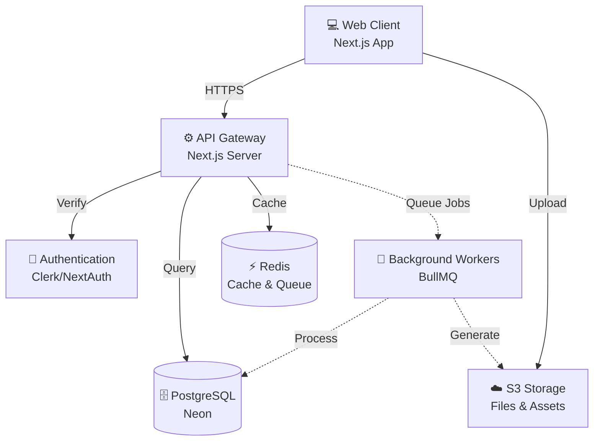

# Trading Journal - System Design Document

**Project:** Trading Journal (Personal → SaaS)  
**Author:** Junaid Ali Khan  
**Version:** 1.0  
**Status:** Draft  
**Last Updated:** December 8, 2025

---

## Executive Summary

This System Design Document outlines the architecture, components, data flows, and implementation strategy for the Trading Journal application—a platform enabling traders to log, analyze, and optimize their trading performance.

**Tech Stack:** Node.js (TypeScript), Next.js, PostgreSQL (Neon), DrizzleORM, Redis, S3-compatible storage, Razorpay, GitHub Actions, Vercel/Render

---

## Table of Contents

1. [Architecture Overview](#1-architecture-overview)
2. [Component Responsibilities](#2-component-responsibilities)
3. [Data Model](#3-data-model)
4. [Multi-Tenancy Design](#4-multi-tenancy-design)
5. [Authentication & Authorization](#5-authentication--authorization)
6. [API Design](#6-api-design)
7. [Analytics & Performance](#7-analytics--performance)
8. [File Storage](#8-file-storage)
9. [Billing & Subscriptions](#9-billing--subscriptions)
10. [Scalability Strategy](#10-scalability-strategy)
11. [Observability](#11-observability)
12. [Security & Compliance](#12-security--compliance)
13. [Deployment Strategy](#13-deployment-strategy)
14. [Implementation Roadmap](#14-implementation-roadmap)
15. [Risk Assessment](#15-risk-assessment)

---

## 1. Architecture Overview

### 1.1 System Architecture

The application follows a modern three-tier architecture with asynchronous processing capabilities:

**Client Layer** → Next.js application with React components  
**Application Layer** → Next.js API routes with authentication middleware  
**Data Layer** → PostgreSQL database, Redis cache, S3 object storage  
**Processing Layer** → BullMQ-powered background workers

### 1.2 Architecture Diagram



### 1.3 Key Architectural Decisions

| Decision | Rationale |
|----------|-----------|
| **Monolithic Next.js App** | Simplified deployment, co-located frontend/backend, optimal for MVP |
| **Single PostgreSQL Database** | Cost-effective, simpler migrations, RLS for tenant isolation |
| **Redis for Caching & Queues** | High-performance caching and reliable job processing |
| **Presigned Upload URLs** | Reduced server load, direct client-to-S3 transfers |
| **Background Workers** | Async processing for imports, exports, and analytics |

---

## 2. Component Responsibilities

### 2.1 Frontend (Next.js)

**Pages & Features:**
- Dashboard with key metrics and equity curve
- Trade list with filtering, sorting, pagination
- Trade detail and edit forms
- Tag management interface
- Settings and billing portal

**Technical Responsibilities:**
- Client-side validation with Zod schemas
- Optimistic UI updates for better UX
- File upload handling via presigned URLs
- State management with React hooks/context
- Responsive design with Tailwind CSS

### 2.2 API Layer

**Structure:**
```
/api/v1/
  ├── auth/           # Authentication endpoints
  ├── trades/         # Trade CRUD operations
  ├── tags/           # Tag management
  ├── analytics/      # Performance metrics
  ├── uploads/        # File upload handling
  ├── billing/        # Subscription management
  └── webhooks/       # External service integrations
```

**Responsibilities:**
- Request validation and sanitization
- Authentication and authorization
- Business logic orchestration
- Response formatting
- Error handling and logging

### 2.3 Service Layer

**Core Services:**
- **TradeService:** PnL calculations, trade validation, CRUD operations
- **AnalyticsService:** Statistics computation, equity curves, performance metrics
- **ImportService:** CSV parsing, data validation, bulk inserts
- **ExportService:** PDF/CSV report generation
- **UploadService:** Presigned URL generation, metadata storage

### 2.4 Data Access Layer

**DrizzleORM Integration:**
- Type-safe database queries
- Schema-driven migrations
- Transaction support
- Query builder for complex analytics

### 2.5 Background Workers

**Job Types:**
- CSV import processing (large files)
- Report generation (PDF/Excel)
- Stats cache regeneration
- Scheduled email reports
- Webhook retry logic

---

## 3. Data Model

### 3.1 Core Entities

#### Users
```typescript
{
  id: uuid (PK)
  email: string (unique)
  name: string
  password_hash: string (nullable, if using OAuth)
  identity_provider: string (nullable)
  created_at: timestamp
  updated_at: timestamp
}
```

#### Tenants
```typescript
{
  id: uuid (PK)
  name: string
  owner_user_id: uuid (FK → users)
  created_at: timestamp
}
```

#### Trades
```typescript
{
  id: uuid (PK)
  tenant_id: uuid (FK → tenants)
  user_id: uuid (FK → users)
  symbol: string (indexed)
  side: enum('long', 'short')
  entry_price: decimal(12,4)
  exit_price: decimal(12,4)
  quantity: decimal(12,4)
  fees: decimal(10,2)
  pnl: decimal(12,2) (computed)
  entry_timestamp: timestamp (indexed)
  exit_timestamp: timestamp (indexed)
  notes: text
  created_at: timestamp
  updated_at: timestamp
}
```

#### Tags
```typescript
{
  id: uuid (PK)
  tenant_id: uuid (FK → tenants)
  name: string
  color: string
  created_at: timestamp
}
```

#### Trade_Tags (Junction Table)
```typescript
{
  trade_id: uuid (FK → trades)
  tag_id: uuid (FK → tags)
  PRIMARY KEY (trade_id, tag_id)
}
```

#### Uploads
```typescript
{
  id: uuid (PK)
  tenant_id: uuid (FK → tenants)
  trade_id: uuid (FK → trades, nullable)
  url: string
  storage_key: string
  mime_type: string
  size_bytes: integer
  created_at: timestamp
}
```

#### Subscriptions
```typescript
{
  id: uuid (PK)
  tenant_id: uuid (FK → tenants)
  razorpay_customer_id: string
  plan: enum('free', 'pro', 'enterprise')
  status: enum('active', 'cancelled', 'past_due')
  current_period_start: timestamp
  current_period_end: timestamp
  created_at: timestamp
}
```

#### Stats_Cache
```typescript
{
  id: uuid (PK)
  tenant_id: uuid (FK → tenants)
  date_window: string (e.g., '2025-12', 'all')
  total_trades: integer
  winning_trades: integer
  losing_trades: integer
  win_rate: decimal(5,2)
  avg_return: decimal(8,4)
  total_pnl: decimal(12,2)
  max_drawdown: decimal(8,4)
  last_updated: timestamp
}
```

### 3.2 Key Indexes

```sql
CREATE INDEX idx_trades_tenant_exit ON trades(tenant_id, exit_timestamp);
CREATE INDEX idx_trades_tenant_symbol ON trades(tenant_id, symbol);
CREATE INDEX idx_trades_pnl ON trades(tenant_id, pnl) WHERE exit_timestamp IS NOT NULL;
CREATE INDEX idx_tags_tenant ON tags(tenant_id);
```

### 3.3 Entity Relationship Diagram

```
users 1--* tenants
tenants 1--* trades
tenants 1--* tags
trades *--* tags (via trade_tags)
trades 1--* uploads
tenants 1--1 subscriptions
```

---

## 4. Multi-Tenancy Design

### 4.1 Chosen Approach

**Single Database + Shared Schema + Row-Level Security (RLS)**

Every tenant-scoped table includes a `tenant_id` column. PostgreSQL RLS policies enforce data isolation at the database level.

### 4.2 Implementation Strategy

**Schema Pattern:**
```sql
-- Example RLS policy
ALTER TABLE trades ENABLE ROW LEVEL SECURITY;

CREATE POLICY tenant_isolation ON trades
  USING (tenant_id = current_setting('app.current_tenant_id')::uuid);
```

**Application Layer:**
```typescript
// Middleware sets tenant context
app.use(async (req, res, next) => {
  const tenantId = req.user.tenantId;
  await db.execute(sql`SET app.current_tenant_id = ${tenantId}`);
  next();
});
```

### 4.3 Advantages

✅ Simple migrations and schema management  
✅ Cost-effective for early-stage SaaS  
✅ Easy cross-tenant analytics for platform insights  
✅ Database-level security guarantees

### 4.4 Alternative Considered

**Separate Database Per Tenant:**
- Stronger isolation
- Independent scaling
- Higher operational complexity
- Recommended for enterprise tier customers only

---

## 5. Authentication & Authorization

### 5.1 Authentication Flow

**Recommended: Clerk.dev** (for faster SaaS launch)  
**Alternative: NextAuth.js** (for full control)

#### Token Strategy

- **Access Token:** JWT, short-lived (15 minutes)
- **Refresh Token:** HTTP-only cookie, 30-day expiry
- **Storage:** Redis with key rotation

#### Login Sequence

```
1. User submits credentials
2. Server validates against DB/OAuth provider
3. Generate JWT access token + refresh token
4. Store refresh token in Redis with user mapping
5. Return JWT to client, refresh token as HTTP-only cookie
6. Client includes JWT in Authorization header
7. On expiry, use refresh endpoint to get new JWT
8. Logout revokes refresh token from Redis
```

### 5.2 Authorization Model

**Role-Based Access Control (RBAC):**

| Role | Permissions |
|------|-------------|
| **Owner** | Full tenant access, billing, user management |
| **Admin** | All trading operations, view billing |
| **Member** | Create/edit own trades, view shared analytics |
| **Viewer** | Read-only access to trades and analytics |

### 5.3 Security Measures

- Argon2 password hashing (if self-implementing)
- Rate limiting on auth endpoints (10 attempts/hour)
- CSRF protection via SameSite cookies
- MFA support (via Clerk or custom TOTP)
- Session invalidation on password change

---

## 6. API Design

### 6.1 RESTful API Structure

**Base URL:** `https://api.tradingjournal.com/v1`

#### Authentication Endpoints

```http
POST /auth/register
Content-Type: application/json

{
  "email": "trader@example.com",
  "name": "John Doe",
  "password": "SecurePass123!"
}

Response: 201 Created
{
  "user": { "id": "...", "email": "...", "name": "..." },
  "accessToken": "eyJhbG..."
}
```

```http
POST /auth/login
Content-Type: application/json

{
  "email": "trader@example.com",
  "password": "SecurePass123!"
}

Response: 200 OK
{
  "accessToken": "eyJhbG..."
}
Set-Cookie: refreshToken=...; HttpOnly; Secure; SameSite=Strict
```

```http
POST /auth/refresh
Cookie: refreshToken=...

Response: 200 OK
{
  "accessToken": "eyJhbG..."
}
```

#### Trade Endpoints

```http
POST /trades
Authorization: Bearer {accessToken}
Content-Type: application/json

{
  "symbol": "AAPL",
  "side": "long",
  "entryPrice": 175.50,
  "exitPrice": 182.30,
  "quantity": 100,
  "fees": 2.50,
  "entryTimestamp": "2025-12-01T09:30:00Z",
  "exitTimestamp": "2025-12-01T15:45:00Z",
  "notes": "Strong earnings momentum",
  "tags": ["earnings", "tech"]
}

Response: 201 Created
{
  "id": "...",
  "pnl": 680.00,
  ...
}
```

```http
GET /trades?from=2025-01-01&to=2025-12-31&symbol=AAPL&tag=earnings&win=true&page=1&limit=50
Authorization: Bearer {accessToken}

Response: 200 OK
{
  "items": [...],
  "total": 127,
  "page": 1,
  "limit": 50
}
```

```http
GET /trades/{id}
PUT /trades/{id}
DELETE /trades/{id}
```

#### Analytics Endpoints

```http
GET /analytics/summary?from=2025-01-01&to=2025-12-31
Authorization: Bearer {accessToken}

Response: 200 OK
{
  "totalTrades": 245,
  "winningTrades": 147,
  "losingTrades": 98,
  "winRate": 60.0,
  "totalPnL": 12450.50,
  "avgReturn": 2.3,
  "maxDrawdown": -8.5,
  "sharpeRatio": 1.8
}
```

```http
GET /analytics/equity?from=2025-01-01&to=2025-12-31&granularity=daily
Authorization: Bearer {accessToken}

Response: 200 OK
{
  "points": [
    { "date": "2025-01-01", "equity": 10000.00 },
    { "date": "2025-01-02", "equity": 10150.25 },
    ...
  ]
}
```

#### Upload Endpoints

```http
POST /uploads/presign
Authorization: Bearer {accessToken}
Content-Type: application/json

{
  "filename": "trade-screenshot.png",
  "mimeType": "image/png",
  "tradeId": "..." // optional
}

Response: 200 OK
{
  "uploadUrl": "https://s3.amazonaws.com/...",
  "fileUrl": "https://cdn.tradingjournal.com/...",
  "storageKey": "uploads/..."
}
```

### 6.2 API Design Principles

- **Versioning:** URL-based (`/v1/`, `/v2/`)
- **Validation:** Zod schemas at middleware layer
- **Pagination:** Cursor-based for large datasets, offset for analytics
- **Error Format:** RFC 7807 Problem Details
- **Rate Limiting:** 1000 requests/hour per user, 100/hour for analytics

### 6.3 Error Response Format

```json
{
  "type": "https://api.tradingjournal.com/errors/validation",
  "title": "Validation Error",
  "status": 400,
  "detail": "Invalid trade data provided",
  "errors": [
    {
      "field": "entryPrice",
      "message": "Must be a positive number"
    }
  ],
  "requestId": "req_abc123xyz"
}
```

---

## 7. Analytics & Performance

### 7.1 Analytics Strategy

**Hybrid Approach:**
- **Real-time:** Simple queries with proper indexes
- **Precomputed:** Complex aggregations cached in `stats_cache` table
- **On-demand:** Background jobs regenerate heavy analytics

### 7.2 Key Queries

#### Equity Curve Calculation

```sql
SELECT 
  exit_timestamp::date as date,
  SUM(pnl) OVER (ORDER BY exit_timestamp::date) as cumulative_pnl
FROM trades
WHERE tenant_id = $1 
  AND exit_timestamp BETWEEN $2 AND $3
ORDER BY date;
```

#### Performance Metrics

```sql
WITH trade_stats AS (
  SELECT
    COUNT(*) as total_trades,
    COUNT(*) FILTER (WHERE pnl > 0) as wins,
    COUNT(*) FILTER (WHERE pnl < 0) as losses,
    SUM(pnl) as total_pnl,
    AVG(pnl) as avg_pnl,
    STDDEV(pnl) as pnl_stddev
  FROM trades
  WHERE tenant_id = $1 
    AND exit_timestamp BETWEEN $2 AND $3
)
SELECT 
  *,
  (wins::float / NULLIF(total_trades, 0) * 100) as win_rate,
  (avg_pnl / NULLIF(pnl_stddev, 0)) as sharpe_ratio
FROM trade_stats;
```

### 7.3 Caching Strategy

**Redis Cache Layers:**

| Layer | TTL | Invalidation |
|-------|-----|--------------|
| Summary stats | 5 minutes | On trade create/update/delete |
| Daily equity | 1 hour | On trade modification for that day |
| Monthly reports | 24 hours | Manual or scheduled |

**Cache Key Pattern:**
```
analytics:{tenant_id}:{metric}:{date_range}:{filters_hash}
```

### 7.4 Performance Optimizations

- **Partial Indexes:** For common filters (winning trades, specific symbols)
- **Materialized Views:** For monthly/yearly aggregations
- **Query Planner Hints:** For complex analytics
- **Connection Pooling:** pgBouncer with transaction mode
- **Read Replicas:** Route analytics queries to replicas

---

## 8. File Storage

### 8.1 Storage Architecture

**Provider:** AWS S3 (primary) or Cloudinary (alternative)  
**Use Cases:** Trade screenshots, CSV imports, generated reports

### 8.2 Upload Flow

```
1. Client requests presigned URL from /uploads/presign
2. Server validates request and generates S3 presigned PUT URL (5-min expiry)
3. Server stores upload metadata in database with 'pending' status
4. Client uploads file directly to S3 using presigned URL
5. Client notifies server of upload completion
6. Server updates upload status to 'completed'
7. Optional: Background worker processes file (virus scan, thumbnail generation)
```

### 8.3 Security Measures

- **File Validation:** MIME type verification, magic number checks
- **Size Limits:** 5 MB for images, 20 MB for CSVs
- **Access Control:** Signed URLs with short expiry for viewing
- **Virus Scanning:** ClamAV integration for user uploads
- **Content Policy:** Reject executables and archives

### 8.4 Storage Organization

```
bucket-name/
├── uploads/
│   ├── {tenant_id}/
│   │   ├── trades/
│   │   │   └── {trade_id}/
│   │   │       └── {uuid}.{ext}
│   │   └── imports/
│   │       └── {uuid}.csv
│   └── reports/
│       └── {tenant_id}/
│           └── {year}/{month}/
│               └── report-{date}.pdf
```

### 8.5 Lifecycle Policies

- Archive trade images older than 2 years to Glacier
- Delete temporary imports after 7 days
- Retain reports for 1 year, then delete

---

## 9. Billing & Subscriptions

### 9.1 Pricing Tiers

| Plan | Price | Trade Limit | Features |
|------|-------|-------------|----------|
| **Free** | ₹0/month | 50 trades/month | Basic analytics, 1 user |
| **Pro** | ₹499/month | 500 trades/month | Advanced analytics, CSV import, 5 users |
| **Enterprise** | Custom | Unlimited | White-label, API access, dedicated support |

### 9.2 Razorpay Integration

**Subscription Flow:**

```
1. User selects plan on billing page
2. Frontend calls /billing/create-subscription
3. Backend creates Razorpay subscription and returns checkout URL
4. User completes payment on Razorpay checkout
5. Razorpay sends webhook to /webhooks/razorpay
6. Backend validates webhook signature
7. Backend updates subscription status in database
8. Backend sends confirmation email to user
```

**Webhook Events:**

- `subscription.activated` → Enable premium features
- `subscription.charged` → Record payment, extend period
- `subscription.cancelled` → Downgrade to free plan
- `payment.failed` → Send payment retry notification

### 9.3 Usage Enforcement

**Middleware Implementation:**

```typescript
async function enforcePlanLimits(req, res, next) {
  const tenant = await getTenant(req.user.tenantId);
  const subscription = await getSubscription(tenant.id);
  
  if (subscription.plan === 'free') {
    const tradeCount = await getMonthlyTradeCount(tenant.id);
    if (tradeCount >= 50) {
      return res.status(403).json({
        error: 'Monthly trade limit reached',
        upgradeUrl: '/billing/upgrade'
      });
    }
  }
  
  next();
}
```

### 9.4 Billing Edge Cases

- **Trial Period:** 14-day free trial with full Pro features
- **Proration:** Calculate prorated charges on mid-cycle upgrades
- **Grace Period:** 7-day grace period for failed payments
- **Cancellation:** Retain data for 30 days post-cancellation

---

## 10. Scalability Strategy

### 10.1 Horizontal Scaling

**Application Tier:**
- Stateless Next.js server instances behind load balancer
- Auto-scaling based on CPU (>70%) and request latency (>500ms)
- Health check endpoint: `/health`

**Worker Tier:**
- BullMQ workers scaled independently
- Scale based on queue backlog (>100 jobs triggers scale-up)
- Graceful shutdown with job completion

### 10.2 Database Scaling

**Read Scaling:**
- PostgreSQL read replicas for analytics queries
- Connection pooling with pgBouncer
- Query result caching in Redis

**Write Scaling:**
- Batch inserts for CSV imports
- Async writes for non-critical data (audit logs)
- Database sharding by `tenant_id` (future consideration)

### 10.3 Caching Strategy

**Cache Hierarchy:**

```
Browser Cache (static assets, 1 year)
    ↓
CDN Cache (images, reports, 1 week)
    ↓
Redis Cache (API responses, 5 min - 1 hour)
    ↓
Database (source of truth)
```

### 10.4 Performance Targets

| Metric | Target | Measurement |
|--------|--------|-------------|
| **Page Load Time** | <2 seconds | Lighthouse, Web Vitals |
| **API Response Time (p95)** | <500ms | Application metrics |
| **Background Job Processing** | <5 min | BullMQ metrics |
| **Database Query Time (p99)** | <100ms | Slow query log |

### 10.5 Load Testing

**Target Capacity:**
- 1,000 concurrent users
- 10,000 requests/minute
- 100 background jobs/minute

**Tools:** Artillery, k6, or Apache JMeter

---

## 11. Observability

### 11.1 Logging Strategy

**Structured Logging with Winston:**

```typescript
logger.info('Trade created', {
  requestId: req.id,
  userId: req.user.id,
  tenantId: req.user.tenantId,
  tradeId: trade.id,
  symbol: trade.symbol,
  duration: Date.now() - req.startTime
});
```

**Log Levels:**
- **ERROR:** Failures requiring immediate attention
- **WARN:** Degraded functionality, retry events
- **INFO:** Normal business operations
- **DEBUG:** Detailed diagnostic information

**Centralized Logging:** Ship logs to Datadog, Grafana Loki, or CloudWatch

### 11.2 Error Tracking

**Sentry Integration:**
- Automatic error capture with source maps
- User context (ID, tenant, plan)
- Breadcrumbs for request flow
- Custom tags for categorization

**Alert Thresholds:**
- Critical errors: >10/hour → PagerDuty alert
- High error rate: >5% → Slack notification
- Slow queries: >1s → Daily digest

### 11.3 Metrics & Monitoring

**Key Metrics (Prometheus format):**

```
http_requests_total{method, route, status}
http_request_duration_seconds{method, route}
database_connections{state}
redis_commands_total{command}
job_processing_duration_seconds{job_type}
job_failures_total{job_type}
subscription_events_total{event_type}
```

**Dashboards:**
- System health (CPU, memory, disk)
- Application performance (latency, throughput)
- Business metrics (signups, trades created, revenue)
- Error rates and types

### 11.4 Alerting Rules

```yaml
- alert: HighErrorRate
  expr: rate(http_requests_total{status=~"5.."}[5m]) > 0.05
  for: 5m
  annotations:
    summary: "High error rate detected"

- alert: DatabaseConnectionPoolExhausted
  expr: database_connections{state="idle"} < 2
  for: 2m
  annotations:
    summary: "Database connection pool nearly exhausted"
```

### 11.5 Tracing

**Distributed Tracing with OpenTelemetry:**
- Trace request flow across services
- Identify slow database queries
- Visualize dependency chains
- Correlate logs with traces

---

## 12. Security & Compliance

### 12.1 Transport Security

- **TLS 1.3** for all connections
- **HSTS** headers with `max-age=31536000`
- **Certificate pinning** for mobile apps

### 12.2 Data Security

**Encryption:**
- At rest: AES-256 for database and S3
- In transit: TLS 1.3
- Sensitive fields: Application-level encryption for notes (optional)

**Secrets Management:**
- AWS Secrets Manager or HashiCorp Vault
- Automated rotation every 90 days
- No secrets in code or environment variables

### 12.3 Access Control

**Principle of Least Privilege:**
- Database users with minimal grants
- API keys with scope restrictions
- IAM roles for service-to-service auth

**Row-Level Security:**
```sql
CREATE POLICY tenant_isolation ON trades
  USING (tenant_id = current_setting('app.current_tenant_id')::uuid);
```

### 12.4 Input Validation

**Defense in Depth:**
- Client-side validation (fast feedback)
- Zod schema validation (API layer)
- Database constraints (last line of defense)
- SQL injection prevention via parameterized queries

### 12.5 Rate Limiting

**Implementation:**

```typescript
// Redis-backed rate limiter
const limiter = rateLimit({
  store: new RedisStore({ client: redis }),
  windowMs: 60 * 60 * 1000, // 1 hour
  max: 1000, // requests per window
  keyGenerator: (req) => req.user.id
});
```

**Limits:**
- Global: 10,000 req/hour per IP
- Authenticated: 1,000 req/hour per user
- Auth endpoints: 10 req/hour per IP

### 12.6 GDPR Compliance

**Data Subject Rights:**

- **Right to Access:** `/api/v1/gdpr/export` endpoint
- **Right to Erasure:** Cascade delete on user/tenant deletion
- **Right to Portability:** JSON/CSV export of all data
- **Right to Rectification:** Standard edit endpoints

**Implementation:**

```typescript
async function exportUserData(userId: string) {
  const data = await db.query.users.findFirst({
    where: eq(users.id, userId),
    with: {
      tenants: {
        with: {
          trades: true,
          tags: true,
          uploads: true
        }
      }
    }
  });
  
  return generateGDPRExport(data);
}
```

### 12.7 Audit Logging

**Audit Trail for Sensitive Operations:**

```typescript
auditLog.create({
  tenantId: req.user.tenantId,
  userId: req.user.id,
  action: 'trade.delete',
  resource: tradeId,
  ipAddress: req.ip,
  userAgent: req.headers['user-agent'],
  timestamp: new Date()
});
```

**Retention:** 1 year for free, 3 years for enterprise

### 12.8 Security Testing

**Regular Activities:**
- **SAST:** SonarQube in CI/CD pipeline
- **DAST:** OWASP ZAP quarterly scans
- **Dependency Scanning:** Snyk/Dependabot weekly
- **Penetration Testing:** Annual third-party audit

---

## 13. Deployment Strategy

### 13.1 Infrastructure

**Environment Setup:**

| Environment | Purpose | Database | Workers | Users |
|-------------|---------|----------|---------|-------|
| **Development** | Local dev | Local PostgreSQL | Disabled | Developers |
| **Staging** | Pre-production | Neon (staging branch) | Enabled | QA team |
| **Production** | Live system | Neon (production) | Auto-scaled | End users |

### 13.2 CI/CD Pipeline

**GitHub Actions Workflow:**

```yaml
name: Deploy

on:
  push:
    branches: [main]

jobs:
  test:
    runs-on: ubuntu-latest
    steps:
      - uses: actions/checkout@v3
      - name: Run tests
        run: npm test
      - name: Type check
        run: npm run typecheck
      - name: Lint
        run: npm run lint

  deploy-staging:
    needs: test
    runs-on: ubuntu-latest
    steps:
      - name: Deploy to Vercel (staging)
        run: vercel deploy --prod=false
      - name: Run migrations
        run: npm run migrate:staging
      - name: Smoke tests
        run: npm run test:e2e

  deploy-production:
    needs: deploy-staging
    runs-on: ubuntu-latest
    environment: production
    steps:
      - name: Deploy to Vercel (production)
        run: vercel deploy --prod
      - name: Run migrations
        run: npm run migrate:production
      - name: Notify team
        run: slack-notify "Deployed v${{ github.sha }}"
```

### 13.3 Database Migrations

**DrizzleORM Migration Process:**

```bash
# Generate migration
npm run db:generate

# Review migration file
cat drizzle/0001_add_trades_table.sql

# Apply to staging
npm run db:migrate:staging

# Apply to production
npm run db:migrate:production

# Rollback procedure
npm run db:rollback
```

**Migration Safety Measures:**
1. Always backup database before migration
2. Test migrations on staging with production-like data
3. Use transactional migrations (single transaction per migration)
4. Include rollback scripts for every migration
5. Monitor migration performance with timeout limits

### 13.4 Deployment Topology

**Vercel (Frontend + API):**
- Automatic scaling
- Edge functions for API routes
- Global CDN for static assets
- Automatic SSL certificates

**Render (Background Workers):**
- Separate service for BullMQ workers
- Autoscaling based on queue length
- Persistent Redis for job storage

**Neon (PostgreSQL):**
- Branching for staging/production
- Point-in-time recovery
- Read replicas for analytics

**Upstash (Redis):**
- Managed Redis with persistence
- TLS encryption
- Automatic backups

### 13.5 Deployment Checklist

**Pre-Deployment:**
- [ ] All tests passing (unit, integration, E2E)
- [ ] No critical security vulnerabilities
- [ ] Performance test results within acceptable range
- [ ] Database migration tested on staging
- [ ] Rollback plan documented and tested

**During Deployment:**
- [ ] Deploy to staging, verify functionality
- [ ] Run smoke tests on staging
- [ ] Apply database migrations
- [ ] Deploy to production with zero-downtime strategy
- [ ] Enable feature flags gradually (if applicable)
- [ ] Monitor error rates and performance metrics

**Post-Deployment:**
- [ ] Verify key user journeys
- [ ] Monitor error rates for 1 hour
- [ ] Send deployment notification to team
- [ ] Update deployment documentation

---

## 14. Implementation Roadmap

### 14.1 Phase 1: MVP (Months 1-2)

**Objective:** Functional trading journal for personal use

**Core Features:**
- User authentication (Clerk integration)
- Trade CRUD operations
- Basic PnL calculations
- Tag system for trade categorization
- Simple dashboard with win rate and total PnL

**Technical Setup:**
- [x] Project initialization with Next.js 14
- [x] PostgreSQL database with Neon
- [x] Authentication setup with Clerk
- [x] DrizzleORM schema definitions
- [ ] Basic API routes for trades and tags
- [ ] Responsive UI with Tailwind CSS
- [ ] Deployment pipeline to Vercel

**Success Metrics:**
- ✅ 10 daily active users (internal testers)
- ✅ <100ms API response time for core endpoints
- ✅ Zero critical bugs in production
- ✅ 100% test coverage for core business logic

### 14.2 Phase 2: Analytics & Reports (Months 3-4)

**Objective:** Add advanced analytics and export capabilities

**New Features:**
- Advanced performance metrics (Sharpe ratio, max drawdown)
- Equity curve visualization
- CSV import/export functionality
- PDF report generation
- Trade filtering by date, symbol, tags

**Technical Implementation:**
- [ ] Analytics service with cached computations
- [ ] BullMQ workers for background processing
- [ ] S3 integration for file storage
- [ ] Chart.js/Recharts integration for visualizations
- [ ] CSV parsing with error handling
- [ ] PDF generation with report templates

**Success Metrics:**
- ✅ 50 daily active users
- ✅ 90% user satisfaction with analytics features
- ✅ Report generation under 30 seconds
- ✅ Import processing for 1000+ trades

### 14.3 Phase 3: Multi-Tenancy SaaS (Months 5-6)

**Objective:** Transform into multi-tenant SaaS platform

**New Features:**
- Team accounts with role-based access
- Subscription plans with billing integration
- Usage limits and enforcement
- Tenant isolation with RLS
- Admin dashboard for tenant management

**Technical Implementation:**
- [ ] Row-Level Security implementation
- [ ] Razorpay subscription integration
- [ ] Plan enforcement middleware
- [ ] Tenant management dashboard
- [ ] User invitation and management
- [ ] Enhanced logging for multi-tenant environment

**Success Metrics:**
- ✅ First 10 paying customers
- ✅ 99.9% uptime SLA
- ✅ Successful handling of 100+ concurrent users
- ✅ <2% payment failure rate

### 14.4 Phase 4: Advanced Features (Months 7-9)

**Objective:** Enterprise features and platform maturation

**New Features:**
- Webhook integrations with trading platforms
- API access for developers
- White-label options for enterprise
- Advanced risk analytics
- Mobile app (React Native)
- Custom report builder

**Technical Implementation:**
- [ ] Webhook handling system
- [ ] Public API with rate limiting
- [ ] Theme customization engine
- [ ] React Native mobile app
- [ ] Advanced risk modeling service
- [ ] Custom report builder with drag-and-drop interface

**Success Metrics:**
- ✅ 100+ paying customers
- ✅ 99.99% uptime
- ✅ <500ms p95 API response time
- ✅ Successful integration with 5+ trading platforms

### 14.5 Phase 5: Scale & Optimization (Months 10-12)

**Objective:** Platform optimization and scaling for growth

**Focus Areas:**
- Performance optimization
- Cost optimization
- Internationalization
- Advanced security features
- Analytics platform for internal insights

**Technical Implementation:**
- [ ] Database sharding strategy
- [ ] CDN optimization for global users
- [ ] Multi-language support
- [ ] Advanced security audit and penetration testing
- [ ] Internal analytics dashboard for business metrics

**Success Metrics:**
- ✅ Support for 10,000+ concurrent users
- ✅ 40% reduction in infrastructure costs
- ✅ Expansion to 3+ languages
- ✅ SOC 2 Type II certification

---

## 15. Risk Assessment

### 15.1 Technical Risks

| Risk | Probability | Impact | Mitigation Strategy |
|------|-------------|---------|-------------------|
| **Database performance degradation** | Medium | High | Implement query optimization, caching strategy, and monitoring |
| **Data loss** | Low | Critical | Regular backups (daily), point-in-time recovery, multi-region replication |
| **Security breach** | Medium | Critical | Regular security audits, penetration testing, encryption at rest and in transit |
| **Service downtime** | Low | High | Multi-region deployment, automated failover, health checks |
| **Third-party service failure** | Medium | Medium | Circuit breaker pattern, fallback mechanisms, multiple provider options |

### 15.2 Business Risks

| Risk | Probability | Impact | Mitigation Strategy |
|------|-------------|---------|-------------------|
| **Low user adoption** | High | High | User research, feedback loops, referral programs, freemium model |
| **Payment processing issues** | Medium | High | Multiple payment gateways, clear error messages, manual override capability |
| **Competitor innovation** | High | Medium | Continuous feature development, focus on UX, community building |
| **Regulatory changes** | Low | Medium | Legal counsel, flexible architecture, monitoring regulatory landscape |
| **Data privacy compliance** | Medium | High | GDPR compliance from day 1, data minimization, clear privacy policy |

### 15.3 Operational Risks

| Risk | Probability | Impact | Mitigation Strategy |
|------|-------------|---------|-------------------|
| **Team member attrition** | Medium | Medium | Documentation, cross-training, modular codebase |
| **Cost overruns** | High | Medium | Budget monitoring, cost alerts, serverless where possible |
| **Feature creep** | High | Medium | Strict MVP focus, user feedback prioritization, roadmap transparency |
| **Technical debt accumulation** | High | Medium | Regular refactoring sprints, code quality gates, automated testing |

### 15.4 Risk Mitigation Implementation Timeline

**Quarter 1-2:**
- Implement comprehensive monitoring and alerting
- Establish backup and disaster recovery procedures
- Basic security measures (HTTPS, password hashing, rate limiting)

**Quarter 3-4:**
- Advanced security features (MFA, audit logging)
- Performance optimization and caching strategy
- Payment gateway redundancy

**Quarter 5-6:**
- Multi-region deployment for high availability
- Advanced compliance features (GDPR, data retention policies)
- Penetration testing and security audits

### 15.5 Contingency Plans

**Data Breach Response:**
1. Immediate incident response team activation
2. Containment and investigation
3. Notification to affected users (within 72 hours per GDPR)
4. Security patch deployment
5. Post-mortem analysis and process improvement

**Service Outage Response:**
1. Automated failover to backup region
2. Communication via status page and email
3. Rollback if caused by recent deployment
4. Investigation and resolution
5. Root cause analysis and prevention measures

**Financial Contingency:**
- 6-month runway maintained at all times
- Multiple payment processor integrations
- Ability to reduce costs by scaling down non-essential features

---

## Appendices

### Appendix A: Third-Party Services

| Service | Purpose | Cost | SLA |
|---------|---------|------|-----|
| **Clerk** | Authentication | $0-25/month | 99.9% |
| **Neon** | PostgreSQL | $0-50/month | 99.95% |
| **Upstash** | Redis | $0-20/month | 99.9% |
| **AWS S3** | File storage | $0-10/month | 99.99% |
| **Vercel** | Hosting | $0-20/month | 99.99% |
| **Render** | Background workers | $0-30/month | 99.9% |
| **Razorpay** | Payments | 2% + ₹3 per transaction | 99.9% |
| **Sentry** | Error tracking | $0-26/month | 99.9% |

### Appendix B: Development Tools

| Tool | Purpose | Integration |
|------|---------|-------------|
| **GitHub** | Source control, CI/CD | Webhooks, Actions |
| **VSCode** | Development environment | Extensions for TypeScript, Tailwind |
| **Docker** | Local development | Docker Compose for services |
| **Postman** | API testing | Collection sharing |
| **Figma** | UI/UX design | Design system components |
| **Notion** | Documentation | Project management |
| **Slack** | Communication | Alert notifications |

### Appendix C: Performance Benchmarks

**Target Benchmarks:**

| Metric | Target | Current | Status |
|--------|--------|---------|--------|
| **Time to First Byte** | <200ms | N/A | Pending |
| **First Contentful Paint** | <1.5s | N/A | Pending |
| **API Response Time (p95)** | <500ms | N/A | Pending |
| **Database Query Time** | <100ms | N/A | Pending |
| **Concurrent Users** | 1000+ | N/A | Pending |
| **Uptime** | 99.95% | N/A | Pending |

**Measurement Tools:**
- Lighthouse for web performance
- k6 for load testing
- pg_stat_statements for database monitoring
- Application Performance Monitoring (APM) for runtime metrics

### Appendix D: Compliance Checklist

- [ ] Privacy Policy and Terms of Service
- [ ] GDPR compliance (data portability, right to be forgotten)
- [ ] Payment Card Industry Data Security Standard (PCI DSS) for payment handling
- [ ] Regular security audits and penetration testing
- [ ] Data backup and disaster recovery plan
- [ ] Incident response plan
- [ ] Employee security training
- [ ] Access control and authentication policies

---

## Document History

| Version | Date | Author | Changes |
|---------|------|--------|---------|
| 1.0 | December 8, 2025 | Junaid Ali Khan | Initial draft |
| 1.1 | TBD | TBD | Updates based on implementation feedback |

---

## Approval

| Role | Name | Signature | Date |
|------|------|-----------|------|
| Product Owner | TBD | | |
| Lead Developer | TBD | | |
| DevOps Engineer | TBD | | |
| Security Officer | TBD | | |

---

*This document provides a comprehensive system design for the Trading Journal application. It will evolve as the project progresses through implementation and user feedback.*